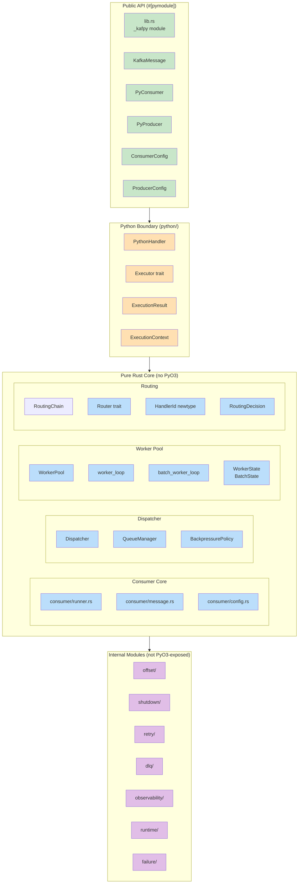
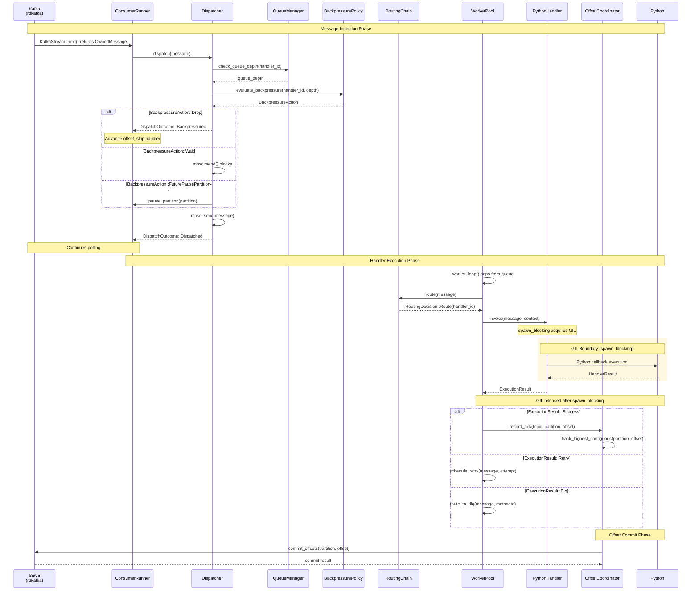
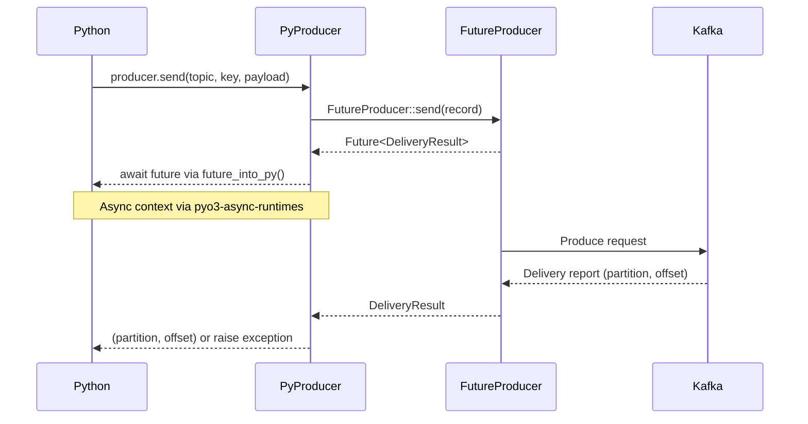
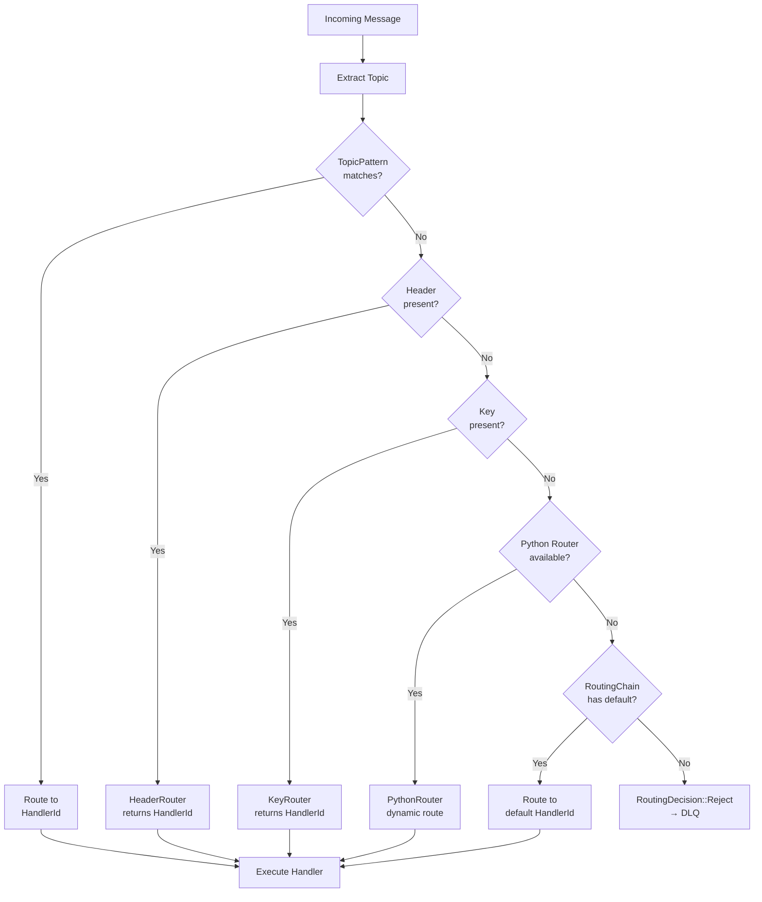
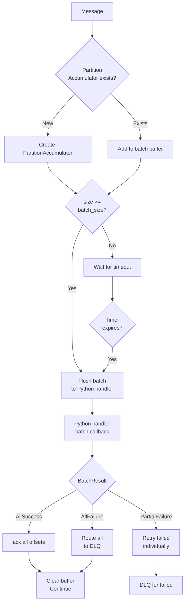
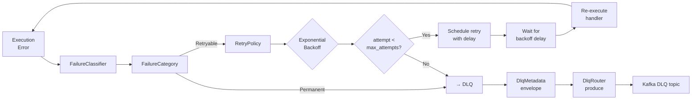
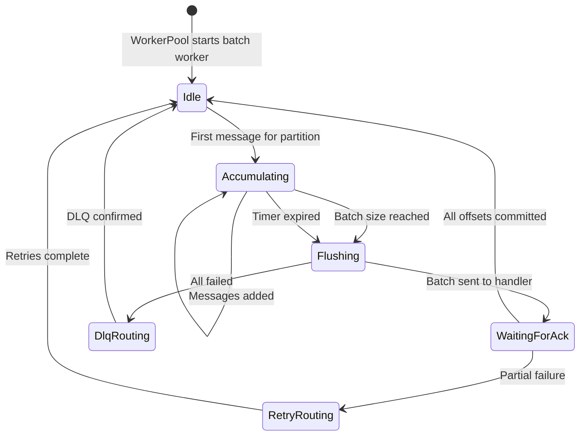
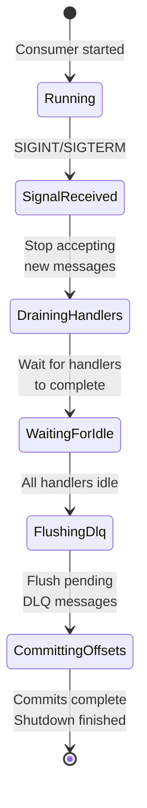
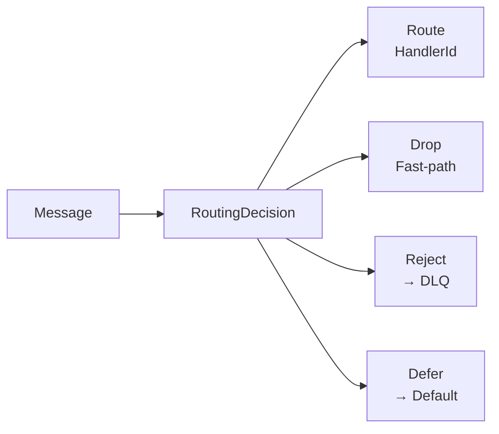
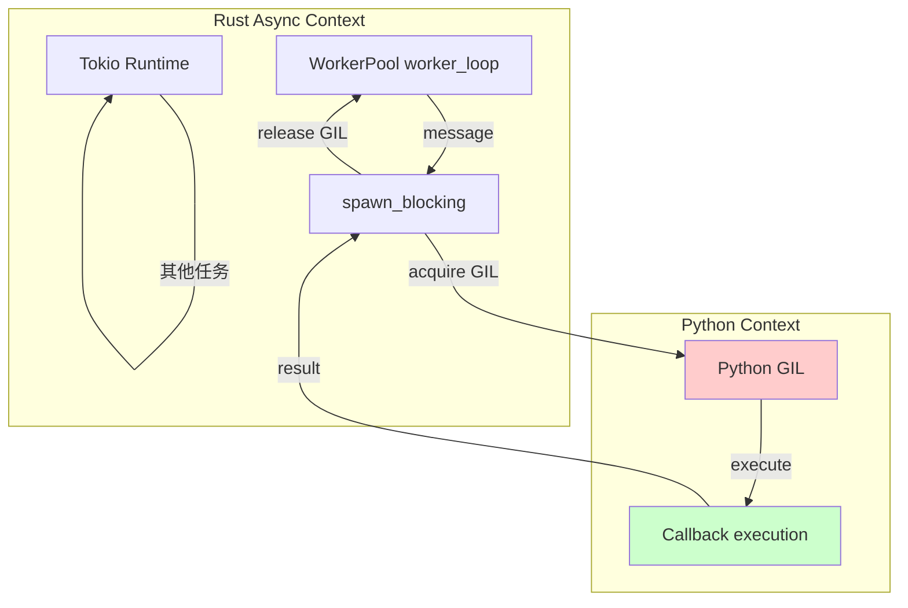

<objective>

Create comprehensive architecture documentation for KafPy using MkDocs + Mermaid diagrams. This serves new contributors (onboarding), API users (public contracts), and maintainers (design rationale).

</objective>

<read_first>

- `.planning/codebase/ARCHITECTURE.md` — existing architecture (outdated, to be refreshed)
- `.planning/codebase/STRUCTURE.md` — codebase structure reference
- `.planning/codebase/STACK.md` — technology stack reference
- `.planning/PROJECT.md` — project vision and key decisions
- `src/lib.rs` — module root and PyO3 exports
- `src/consumer/mod.rs` — consumer module
- `src/dispatcher/mod.rs` — dispatcher module
- `src/worker_pool/mod.rs` — worker pool module
- `src/routing/mod.rs` — routing module
- `src/offset/mod.rs` — offset module
- `src/shutdown/mod.rs` — shutdown module
- `src/retry/mod.rs` — retry module
- `src/dlq/mod.rs` — DLQ module
- `src/failure/mod.rs` — failure module
- `src/observability/mod.rs` — observability module
- `src/runtime/mod.rs` — runtime module
- `src/python/mod.rs` — Python execution module

</read_first>

<tasks>

<task>
<type> setup
<files> mkdocs.yml
<action>

Create `mkdocs.yml` at project root with the following configuration:

```yaml
site_name: KafPy Documentation
site_description: High-performance Kafka client for Python
site_url: https://kafpy.readthedocs.io/

repo_name: dangvansam/kafpy
repo_url: https://github.com/dangvansam/kafpy

theme:
  name: material
  palette:
    - scheme: default
      primary: indigo
      accent: indigo
      toggle:
        icon: material/brightness-7
        name: Switch to dark mode
    - scheme: slate
      primary: indigo
      accent: indigo
      toggle:
        icon: material/brightness-4
        name: Switch to light mode
  features:
    - navigation.instant
    - navigation.tracking
    - navigation.tabs
    - navigation.sections
    - toc.integrate
    - content.code.copy
    - content.code.annotate

plugins:
  - search
  - mermaid2:
      version: 10

markdown_extensions:
  - pymdownx.highlight:
      anchor_linenums: true
  - pymdownx.inlinehilite
  - pymdownx.snippets
  - pymdownx.superfences:
      custom_fences:
        - name: mermaid
          class: mermaid
          format: !!python/name:pymdownx.superfences.fence_code_format

nav:
  - Home: index.md
  - Architecture:
    - architecture/index.md
    - architecture/overview.md
    - architecture/modules.md
    - architecture/message-flow.md
    - architecture/state-machines.md
    - architecture/routing.md
    - architecture/pyboundary.md
  - API Reference: api/kafpy.md
  - Contributing:
    - contributing/setup.md
    - contributing/conventions.md
```

</action>
<verify>

`mkdocs.yml` exists at project root and contains `mermaid2` plugin and `material` theme

</verify>
<acceptance_criteria>

- mkdocs.yml created at project root
- mermaid2 plugin configured
- material theme with dark/light toggle configured
- navigation structure includes architecture section

</acceptance_criteria>
</task>

<task>
<type> documentation
<files> docs/architecture/index.md
<action>

Create `docs/architecture/index.md` — landing page for architecture section:

```markdown
# Architecture

This section documents the internal architecture of KafPy.

## Contents

- [Overview](overview.md) — High-level architecture and design principles
- [Modules](modules.md) — Module-by-module breakdown with responsibilities
- [Message Flow](message-flow.md) — Kafka→Python→Offset commit flow diagrams
- [State Machines](state-machines.md) — WorkerState, BatchState, ShutdownPhase
- [Routing](routing.md) — Routing chain decision tree
- [PyO3 Boundary](pyboundary.md) — GIL boundary patterns and async/sync bridges

## Audience

This documentation serves:

- **New contributors** — Onboarding, setup, coding conventions
- **API users** — Public API contracts, configuration, usage patterns
- **Maintainers** — Design rationale, extension patterns, internals

## Key Design Principles

1. **Rust core / Python business logic** — Performance + idiomatic bindings
2. **PyO3-free consumer core** — Testable without Python interpreter
3. **Per-topic bounded dispatch** — Isolated backpressure per handler
4. **Highest contiguous offset commit** — At-least-once delivery guarantee
5. **Explicit state machines** — WorkerState, BatchState replace boolean flags
```

</action>
<verify>

`docs/architecture/index.md` created with navigation to all sub-docs

</verify>
<acceptance_criteria>

- docs/architecture/index.md exists
- Links to all architecture sub-documents present
- Audience and design principles documented

</acceptance_criteria>
</task>

<task>
<type> documentation
<files> docs/architecture/overview.md
<action>

Create `docs/architecture/overview.md` with high-level architecture overview and Mermaid diagrams:

```markdown
# Architecture Overview

## High-Level Architecture

KafPy is a PyO3 native extension where Rust provides the runtime/core engine and Python holds the business logic.

```mermaid
graph TB
    subgraph Python["Python Layer (kafpy/)"]
        PYC[Consumer<br/>Producer<br/>Config]
    end

    subgraph PyO3["PyO3 Binding Layer (_kafpy)"]
        PYO3[lib.rs<br/>#[pymodule] _kafpy]
    end

    subgraph RustCore["Rust Core (src/)"]
        CONS[consumer/]
        DISP[dispatcher/]
        WORK[worker_pool/]
        ROUT[routing/]
        OFF[offset/]
        SHDN[shutdown/]
        RETRY[retry/]
        DLQ[dlq/]
        OBS[observability/]
        PY[runtime/<br/>python/]
    end

    subgraph Kafka["Kafka (rdkafka)"]
        KAFKA[Bootstrap Servers]
    end

    Python --> PyO3
    PyO3 --> RustCore
    RustCore --> Kafka
    Kafka --> RustCore

    style Python fill:#f5f5f5
    style PyO3 fill:#fff3e0
    style RustCore fill:#e3f2fd
    style Kafka fill:#ffecb3
```

## Module Organization



## Key Design Decisions

| Decision | Rationale | Location |
|----------|-----------|----------|
| Rust core / Python business logic | Performance + idiomatic bindings | src/lib.rs |
| rdkafka for Kafka protocol | Battle-tested, async-capable | Cargo.toml |
| Tokio for async runtime | Native rdkafka compat, mpsc channels | Cargo.toml |
| PyO3-free consumer core | Clean separation, testable without Python | src/consumer/ |
| Per-topic bounded queue dispatch | Isolated backpressure per topic | src/dispatcher/ |
| BackpressurePolicy trait | Extensible backpressure (Drop/Wait/FuturePausePartition) | src/dispatcher/backpressure.rs |
| Executor trait | Future retry/commit/async/batch policies plug in here | src/python/executor.rs |
| OffsetCoordinator trait | Separates offset tracking from Executor policy | src/offset/offset_coordinator.rs |
| Highest contiguous offset commit | Only commit when all prior offsets acked | src/offset/offset_tracker.rs |
| store_offset + commit coordination | enable.auto.offset.store=false, explicit coordination | src/offset/ |
| RetryCoordinator 3-tuple | (should_retry, should_dlq, delay) controls retry and DLQ routing | src/retry/retry_coordinator.rs |
| HandlerId newtype wrapper | Prevents accidental interchange with topic names | src/routing/context.rs |
```

</action>
<verify>

docs/architecture/overview.md created with Mermaid diagrams rendering

</verify>
<acceptance_criteria>

- docs/architecture/overview.md exists
- Two Mermaid diagrams: high-level architecture and module organization
- Key design decisions table present

</acceptance_criteria>
</task>

<task>
<type> documentation
<files> docs/architecture/modules.md
<action>

Create `docs/architecture/modules.md` — comprehensive module-by-module breakdown:

```markdown
# Module Reference

Comprehensive breakdown of all modules in `src/`.

## Public PyO3 API

### `src/lib.rs` — Module Root

**Responsibilities:**
- Initialize logging via `Logger::init()`
- Register all `#[pyclass]` types with Python module
- Export public API surface

**Public API:**
```rust
#[pymodule]
fn _kafpy(m: &Bound<'_, PyModule>) -> PyResult<()> {
    m.add_class::<KafkaMessage>()?;
    m.add_class::<PyConsumer>()?;
    m.add_class::<PyProducer>()?;
    m.add_class::<config::ConsumerConfig>()?;
    m.add_class::<config::ProducerConfig>()?;
    Ok(())
}
```

**Key Files:**
- `src/config.rs` — `ConsumerConfig`, `ProducerConfig` (#[pymodule-exposed])

---

## Pure Rust Consumer Core

### `src/consumer/` — Kafka Consumer Implementation

**Responsibilities:**
- Kafka consumer lifecycle management
- Message streaming via rdkafka `StreamConsumer`
- Custom rebalance callback handling

**Files:**
| File | Purpose |
|------|---------|
| `mod.rs` | Module exports |
| `config.rs` | `ConsumerConfig` internal types |
| `error.rs` | Consumer-specific errors |
| `message.rs` | `OwnedMessage` type |
| `runner.rs` | `ConsumerRunner`, `ConsumerStream`, `ConsumerTask` |

**Key Types:**
```rust
// consumer/runner.rs
pub struct ConsumerRunner {
    consumer: Arc<StreamConsumer<CustomConsumerContext>>,
    dispatcher: ConsumerDispatcher,
    shutdown_token: CancellationToken,
}

pub struct ConsumerStream {
    stream: KafkaStream,
    runner: Arc<ConsumerRunner>,
}

pub struct ConsumerTask {
    runner: Arc<ConsumerRunner>,
}
```

---

### `src/dispatcher/` — Message Dispatcher

**Responsibilities:**
- Route `OwnedMessage` to per-handler bounded Tokio mpsc channels
- Track queue depth and inflight messages per handler
- Apply backpressure when queues are full

**Files:**
| File | Purpose |
|------|---------|
| `mod.rs` | Module exports, `Dispatcher` struct |
| `consumer_dispatcher.rs` | `ConsumerDispatcher` wiring consumer→dispatcher |
| `queue_manager.rs` | `QueueManager` tracking queue depth |
| `backpressure.rs` | `BackpressurePolicy` trait and implementations |
| `error.rs` | Dispatch-specific errors |

**Key Types:**
```rust
// dispatcher/mod.rs
pub struct Dispatcher {
    queues: Arc<HashMap<HandlerId, mpsc::Sender<OwnedMessage>>>,
    queue_manager: Arc<QueueManager>,
    backpressure: Arc<dyn BackpressurePolicy>,
}

// dispatcher/backpressure.rs
pub enum BackpressureAction {
    Drop,           // Reject immediately
    Wait,           // Block until capacity
    FuturePausePartition,  // Pause specific partition
}

pub trait BackpressurePolicy: Send + Sync {
    fn action(&self, handler: &HandlerId, depth: usize) -> BackpressureAction;
}
```

---

### `src/worker_pool/` — Worker Pool

**Responsibilities:**
- N Tokio tasks polling handler queues
- Invoke Python callbacks via `spawn_blocking`
- Batch accumulation for batch handler modes

**Files:**
| File | Purpose |
|------|---------|
| `mod.rs` | Module exports, `WorkerPool` struct |
| `worker.rs` | `worker_loop()` — single-sync handler execution |
| `batch_loop.rs` | `batch_worker_loop()` — batch handler execution |
| `pool.rs` | `WorkerPool` orchestration |
| `state.rs` | `WorkerState`, `BatchState` enums |
| `accumulator.rs` | `PartitionAccumulator` for batch buffering |

**Key Types:**
```rust
// worker_pool/state.rs
pub enum WorkerState {
    Idle,
    Processing { message: OwnedMessage },
    Retrying { message: OwnedMessage, attempt: u32 },
    WaitingForAck { offset: i64 },
}

pub enum BatchState {
    Idle,
    Accumulating { messages: Vec<OwnedMessage>, partition: i32 },
    Flushing { messages: Vec<OwnedMessage>, partition: i32 },
    WaitingForAck { offsets: Vec<i64> },
}
```

---

### `src/routing/` — Message Routing

**Responsibilities:**
- Route messages to handlers based on topic, headers, or keys
- Support pattern-based routing (regex on topic name)
- Python callback router for dynamic routing

**Files:**
| File | Purpose |
|------|---------|
| `mod.rs` | Module exports |
| `chain.rs` | `RoutingChain` — ordered router list |
| `context.rs` | `RoutingContext`, `HandlerId` newtype |
| `decision.rs` | `RoutingDecision` enum |
| `router.rs` | `Router` trait |
| `topic_pattern.rs` | `TopicPatternRouter` |
| `header.rs` | `HeaderRouter` |
| `key.rs` | `KeyRouter` |
| `python_router.rs` | `PythonRouter` for dynamic routing |
| `config.rs` | Routing configuration |

**Key Types:**
```rust
// routing/context.rs
pub struct HandlerId(String);

impl HandlerId {
    pub fn new(id: String) -> Self;
    pub fn as_str(&self) -> &str;
}

// routing/decision.rs
pub enum RoutingDecision {
    Route(HandlerId),      // Route to specific handler
    Drop,                  // Fast-path: drop + advance offset
    Reject,                // Fast-path: direct to DLQ
    Defer,                 // Routing inconclusive → default handler
}
```

---

## Python Integration Layer

### `src/python/` — Python Handler Execution

**Responsibilities:**
- Store Python callbacks (`Py<PyAny>`)
- Execute handlers via `spawn_blocking` (GIL management)
- Batch execution support

**Files:**
| File | Purpose |
|------|---------|
| `mod.rs` | Module exports |
| `handler.rs` | `PythonHandler`, `HandlerConfig` |
| `executor.rs` | `Executor` trait |
| `context.rs` | `ExecutionContext` for handlers |
| `execution_result.rs` | `ExecutionResult`, `ExecutionAction` |
| `batch.rs` | `BatchAccumulator`, `BatchExecutionResult` |
| `async_bridge.rs` | `PythonAsyncFuture` for async handlers |

---

### `src/runtime/` — Runtime Assembly

**Responsibilities:**
- `RuntimeBuilder` for composing consumer runtime
- Wire all components together (config → tracker → dispatcher → handler → worker → committer)

**Files:**
```rust
// runtime/builder.rs
pub struct RuntimeBuilder {
    config: ConsumerConfig,
    handlers: Vec<PythonHandler>,
    routing_chain: RoutingChain,
    offset_coordinator: Arc<dyn OffsetCoordinator>,
    // ...
}

impl RuntimeBuilder {
    pub fn build(self) -> Result<ConsumerRuntime, BuildError>;
}
```

---

## Internal Modules

### `src/offset/` — Offset Tracking

**Responsibilities:**
- Per-topic-partition ack tracking
- Highest contiguous offset calculation
- `store_offset()` + `commit()` coordination

**Files:** `offset_tracker.rs`, `offset_coordinator.rs`, `commit_task.rs`, `mod.rs`

---

### `src/shutdown/` — Shutdown Coordination

**Responsibilities:**
- 4-phase graceful shutdown lifecycle
- `ShutdownPhase` enum (replaces boolean flags)

**Files:** `shutdown.rs`, `mod.rs`

---

### `src/retry/` — Retry Scheduling

**Responsibilities:**
- `RetryPolicy` with exponential backoff + jitter
- `RetryCoordinator` tracking per-message retry state

**Files:** `policy.rs`, `retry_coordinator.rs`, `mod.rs`

---

### `src/dlq/` — Dead Letter Queue

**Responsibilities:**
- `DlqRouter` trait and `DefaultDlqRouter`
- `DlqMetadata` envelope (7 fields)
- Fire-and-forget produce to DLQ topic

**Files:** `router.rs`, `metadata.rs`, `produce.rs`, `mod.rs`

---

### `src/failure/` — Failure Classification

**Responsibilities:**
- `FailureReason` taxonomy
- `FailureCategory` classification
- `FailureClassifier` for retry/DLQ decisions

**Files:** `reason.rs`, `classifier.rs`, `logging.rs`, `mod.rs`

---

### `src/observability/` — Metrics & Tracing

**Responsibilities:**
- `MetricsSink` trait + `PrometheusMetricsSink` adapter
- OTLP tracing with W3C tracecontext propagation
- `RuntimeSnapshot` for zero-cost introspection

**Files:** `metrics.rs`, `tracing.rs`, `runtime_snapshot.rs`, `config.rs`, `mod.rs`

---

### `src/error.rs` — Unified Error Re-exports

**Purpose:** Single import point for all error types

```rust
pub use errors::{DispatchError, ConsumerError, CoordinatorError, PyError};
```
```

</action>
<verify>

docs/architecture/modules.md exists with all module documentation

</verify>
<acceptance_criteria>

- All src/ modules documented
- Tables for files and key types
- Cross-references between modules

</acceptance_criteria>
</task>

<task>
<type> documentation
<files> docs/architecture/message-flow.md
<action>

Create `docs/architecture/message-flow.md` with message flow diagrams:

```markdown
# Message Flow

## Consumer Message Flow

Detailed flow from Kafka message arrival to Python handler execution and offset commit.



## Producer Message Flow



## Routing Chain Precedence



## Batch Handler Flow



## Retry/DLQ Flow


```

</action>
<verify>

docs/architecture/message-flow.md exists with Mermaid sequenceDiagram and flowchart diagrams

</verify>
<acceptance_criteria>

- Consumer message flow documented with sequence diagram
- Producer message flow documented
- Routing chain precedence documented
- Batch handler flow documented
- Retry/DLQ flow documented

</acceptance_criteria>
</task>

<task>
<type> documentation
<files> docs/architecture/state-machines.md
<action>

Create `docs/architecture/state-machines.md` with state machine diagrams:

```markdown
# State Machines

KafPy uses explicit state enums instead of boolean flags for better type safety and exhaustive matching.

## WorkerState

The `WorkerState` enum tracks the state of a worker task processing a message.

```mermaid
stateDiagram-v2
    [*] --> Idle: WorkerPool spawns worker
    Idle --> Processing: Message received from queue
    Processing --> Retrying: ExecutionResult::Retry
    Processing --> WaitingForAck: Message executed, awaiting ack
    Retrying --> Processing: Backoff elapsed, retry execution
    Retrying --> WaitingForAck: Retry succeeded
    Retrying --> DlqRouting: Max retries exceeded
    WaitingForAck --> Idle: Offset committed
    DlqRouting --> Idle: DLQ produce confirmed
    Processing --> DlqRouting: ExecutionResult::Dlq
```

### States

| State | Meaning |
|-------|---------|
| `Idle` | Worker ready to process next message |
| `Processing` | Currently executing Python handler |
| `Retrying` | Scheduled for retry after backoff |
| `WaitingForAck` | Handler succeeded, waiting for offset commit |
| `DlqRouting` | Routing to DLQ after permanent failure |

### Transitions

```rust
// worker_pool/state.rs
pub enum WorkerState {
    Idle,
    Processing { message: OwnedMessage },
    Retrying {
        message: OwnedMessage,
        attempt: u32,
        next_retry_at: Instant,
    },
    WaitingForAck {
        offset: i64,
        partition: i32,
        topic: String,
    },
    DlqRouting {
        message: OwnedMessage,
        reason: FailureReason,
    },
}
```

---

## BatchState

The `BatchState` enum tracks batch accumulation and flush for batch handler modes.



### States

| State | Meaning |
|-------|---------|
| `Idle` | No batch in progress |
| `Accumulating` | Collecting messages for batch |
| `Flushing` | Batch sent to Python handler |
| `WaitingForAck` | Awaiting offset commits for batch |
| `RetryRouting` | Individual retry/DLQ for failed messages |
| `DlqRouting` | All batch messages routing to DLQ |

---

## ShutdownPhase

The `ShutdownPhase` enum tracks the 4-phase graceful shutdown lifecycle.



### Phases

| Phase | Description |
|-------|-------------|
| `Running` | Normal operation |
| `SignalReceived` | Shutdown signal received, stop accepting new messages |
| `DrainingHandlers` | Waiting for in-flight handler executions |
| `WaitingForIdle` | All handlers complete, flush DLQ |
| `FlushingDlq` | Producing remaining DLQ messages |
| `CommittingOffsets` | Final offset commit before exit |

---

## RetryCoordinator State

The `RetryCoordinator` tracks retry state per message using a 3-tuple.

```mermaid
stateDiagram-v2
    [*] --> NotScheduled: Message received
    NotScheduled --> Scheduled: RetryPolicy::should_retry
    Scheduled --> NotScheduled: Retry succeeded (ack)
    Scheduled --> DlqRouting: should_dlq = true
    Scheduled --> Exhausted: attempt >= max_attempts
    DlqRouting --> [*]
    Exhausted --> [*]
```

### 3-Tuple Decision

```rust
pub struct RetryDecision {
    pub should_retry: bool,
    pub should_dlq: bool,
    pub delay: Option<Duration>,
}
```

| should_retry | should_dlq | delay | Action |
|-------------|------------|-------|--------|
| true | false | Some(d) | Retry after delay |
| true | true | Some(d) | Retry then DLQ if fails |
| false | true | None | Immediate DLQ |
| false | false | None | Ack without commit (silent drop) |

---

## HandlerMode State

The `HandlerMode` enum (from v1.6) determines how handlers execute.

```mermaid
stateDiagram-v2
    [*] --> ModeSelected: Handler registered

    ModeSelected --> SingleSync: HandlerMode::SingleSync
    ModeSelected --> SingleAsync: HandlerMode::SingleAsync
    ModeSelected --> BatchSync: HandlerMode::BatchSync
    ModeSelected --> BatchAsync: HandlerMode::BatchAsync

    SingleSync --> [*]: Handler completes
    SingleAsync --> [*]: Future completes
    BatchSync --> [*]: Batch completes
    BatchAsync --> [*]: Batch future completes
```

### Modes

| Mode | Description |
|------|-------------|
| `SingleSync` | One message at a time, synchronous handler |
| `SingleAsync` | One message at a time, async handler via `into_future()` |
| `BatchSync` | Fixed-window batch, synchronous batch handler |
| `BatchAsync` | Fixed-window batch, async batch handler |
```

</action>
<verify>

docs/architecture/state-machines.md exists with Mermaid stateDiagram diagrams

</verify>
<acceptance_criteria>

- WorkerState state machine documented
- BatchState state machine documented
- ShutdownPhase state machine documented
- RetryCoordinator state documented
- HandlerMode documented

</acceptance_criteria>
</task>

<task>
<type> documentation
<files> docs/architecture/routing.md
<action>

Create `docs/architecture/routing.md` with routing chain documentation:

```markdown
# Routing

KafPy routes messages to Python handlers through a configurable routing chain with precedence-based evaluation.

## Routing Chain Architecture

```mermaid
graph TD
    MSG[Incoming Message] --> CTX[RoutingContext<br/>topic, key, headers, payload]

    CTX --> CHAIN[RoutingChain<br/>Ordered Router List]

    subgraph Routers
        TP[TopicPatternRouter<br/>Regex on topic name]
        HR[HeaderRouter<br/>HTTP-header-like headers]
        KR[KeyRouter<br/>Message key routing]
        PY[PythonRouter<br/>Dynamic Python callback]
    end

    CHAIN --> TP
    TP -->|No match| HR
    HR -->|No match| KR
    KR -->|No match| PY
    PY -->|No match| DEF[Default Handler<br/>(optional)]

    TP -->|Match| DEC[RoutingDecision::Route]
    HR -->|Match| DEC
    KR -->|Match| DEC
    PY -->|Match| DEC
    DEF -->|Match| DEC

    DEC --> EXEC[Execute Handler<br/>at HandlerId]
```

## Routing Precedence

The routing chain evaluates in order:

1. **TopicPatternRouter** — Regex match against topic name
2. **HeaderRouter** — HTTP-header-like headers on message
3. **KeyRouter** — Message key (bytes) lookup
4. **PythonRouter** — Dynamic routing via Python callback
5. **Default Handler** — Falls back if no router matches

### Configuration Example

```python
# Routing configuration
routing_config = kafpy.RoutingConfig(
    default_handler="default-handler",
    routers=[
        kafpy.TopicPatternRouter(
            pattern=r"^orders\.",
            handler="order-handler",
        ),
        kafpy.HeaderRouter(
            header_name="x-event-type",
            mapping={
                "order.created": "order-created-handler",
                "order.updated": "order-updated-handler",
            },
        ),
    ],
)
```

## RoutingDecision



| Decision | Description | Use Case |
|----------|-------------|----------|
| `Route(HandlerId)` | Route to specific handler | Normal routing |
| `Drop` | Drop message, advance offset | Traffic shaping, sampling |
| `Reject` | Route directly to DLQ | Validation failures |
| `Defer` | Continue chain to next router | Partial routing |

## RoutingContext

```rust
// routing/context.rs
pub struct RoutingContext<'a> {
    pub topic: &'a str,
    pub partition: i32,
    pub offset: i64,
    pub key: Option<&'a [u8]>,
    pub payload: Option<&'a [u8]>,
    pub headers: &'a [(String, Vec<u8>)],
    pub handler_id: Option<HandlerId>,
}

pub struct HandlerId(String);

impl HandlerId {
    pub fn new(id: String) -> Self;
    pub fn as_str(&self) -> &str;
}
```

## HandlerId Type Safety

`HandlerId` is a newtype wrapper around `String` to prevent accidental interchange with topic names:

```rust
// Bad: Using String directly
fn route_to_handler(topic: String) { }

// Good: Using HandlerId newtype
fn route_to_handler(handler_id: HandlerId) { }

// Compile-time safety: HandlerId != String
let topic: String = "my-topic".to_string();
let handler_id: HandlerId = HandlerId::new("my-handler".to_string());

// This won't compile:
// route_to_handler(topic);  // Error: expected HandlerId, found String
```
```

</action>
<verify>

docs/architecture/routing.md exists with routing chain diagrams

</verify>
<acceptance_criteria>

- Routing chain architecture documented
- Routing precedence explained
- RoutingDecision variants documented
- HandlerId type safety explained

</acceptance_criteria>
</task>

<task>
<type> documentation
<files> docs/architecture/pyboundary.md
<action>

Create `docs/architecture/pyboundary.md` with PyO3 boundary documentation:

```markdown
# PyO3 Boundary

Documentation of the GIL boundary, async bridges, and type conversions between Rust and Python.

## GIL Management Strategy

Python's Global Interpreter Lock (GIL) prevents concurrent Python code execution. KafPy minimizes GIL hold time by:

1. **All Python calls go through `spawn_blocking`** — Releases GIL during Python execution
2. **Rust async continues during Python calls** — Other tasks progress while waiting
3. **No GIL held across Rust orchestration** — GIL only acquired for actual Python calls



## spawn_blocking Pattern

```rust
// python/handler.rs
impl PythonHandler {
    pub async fn execute(
        &self,
        message: OwnedMessage,
        context: ExecutionContext,
    ) -> ExecutionResult {
        let py_callback = self.callback.clone();

        tokio::task::spawn_blocking(move || {
            // GIL acquired here automatically
            Python::with_gil(|py| {
                let result = py_callback.call1(py, (/* args */));
                // GIL released when closure returns
            })
        })
        .await
        .map_err(|_| ExecutionError::TaskCancelled)?
    }
}
```

## Async/Sync Bridge

KafPy uses `pyo3-async-runtimes` to bridge Python async with Rust Tokio:

```mermaid
sequenceDiagram
    participant P as Python<br/>async def handler
    participant PA as PythonAsyncFuture
    participant T as Tokio Runtime
    participant K as Kafka

    Note over P: Python async def handler(msg):
        return await process(msg)

    P->>PA: Create future via PEP-492
    PA->>T: future_into_py() registers with Tokio
    T->>K: Kafka message arrives
    K-->>T: OwnedMessage
    T->>PA: poll() called
    PA->>P: Python coroutine advances
    P-->>PA: await yields
    PA-->>T: Poll::Pending
    T->>T: yield to other tasks
    T->>PA: poll() called again
    PA->>P: Python coroutine completes
    P-->>PA: result
    PA-->>T: Poll::Ready(result)
```

## Type Conversions

### Rust → Python

```rust
use pyo3::prelude::*;

// Rust struct becomes Python class
#[pyclass]
pub struct KafkaMessage {
    #[pyo3(get)]
    topic: String,
    #[pyo3(get)]
    partition: i32,
    #[pyo3(get)]
    offset: i64,
    #[pyo3(get)]
    payload: Option<Vec<u8>>,
}

// Rust error becomes Python exception
fn risky_operation() -> PyResult<i32> {
    Err(PyErr::new::<pyo3::exceptions::PyValueError, _>("invalid input"))
}
```

### Python → Rust

```rust
// Python callable stored as Py<PyAny>
#[pyclass]
pub struct PythonHandler {
    callback: Py<PyAny>,
}

// Call Python from Rust
fn invoke_callback(callback: &Py<PyAny>, py: Python<'_>) -> PyResult<HandlerResult> {
    callback.call1(py, (message,), None)
}
```

## Thread Safety Patterns

### Arc<RwLock<T>> for Shared Mutable State

```rust
// pyconsumer.rs
pub struct PyConsumer {
    runtime: Arc<RwLock<Option<ConsumerRuntime>>>,
}

impl PyConsumer {
    pub fn start(&self, py: Python<'_>) -> PyResult<Py<PyAny>> {
        let runtime = self.runtime.clone();
        future_into_py(py, async move {
            let mut guard = runtime.write().await;
            if guard.is_none() {
                *guard = Some(self.build_runtime().await?);
            }
            // ...
        })
    }
}
```

### Send + Sync Guarantees

Compile-time assertions ensure all shared types are thread-safe:

```rust
// lib.rs
fn _assert_send_sync_routing()
where
    crate::routing::HandlerId: Send + Sync,
    crate::routing::context::RoutingContext<'static>: Send + Sync,
    crate::routing::decision::RoutingDecision: Send + Sync,
    crate::routing::key::KeyRouter: Send + Sync,
{}

#[cfg(test)]
mod send_sync_assertions {
    #[test]
    fn routing_types_are_send_sync() {
        super::_assert_send_sync_routing();
    }
}
```
```

</action>
<verify>

docs/architecture/pyboundary.md exists with GIL boundary diagrams

</verify>
<acceptance_criteria>

- GIL management strategy documented
- spawn_blocking pattern explained
- async/sync bridge documented
- Type conversion patterns documented
- Thread safety patterns documented

</acceptance_criteria>
</task>

<task>
<type> verification
<files> mkdocs.yml
<action>

Verify MkDocs build works:

```bash
cd /home/nghiem/project/KafPy
# Install mkdocs-material and mermaid2 plugin
pip install mkdocs-material mkdocs-mermaid2-plugin

# Build documentation
mkdocs build --strict --verbose
```

This will fail if:
- mkdocs.yml has syntax errors
- Mermaid diagram syntax is invalid
- Referenced files don't exist

</action>
<verify>

`mkdocs build` succeeds with no errors

</verify>
<acceptance_criteria>

- `mkdocs build` exits with code 0
- All Mermaid diagrams render without errors
- docs/architecture/ section is accessible

</acceptance_criteria>
</task>

</tasks>

<verification>

## Verification Steps

1. **MkDocs Configuration**
   ```bash
   mkdocs build --strict
   ```
   - Must exit with code 0
   - No Mermaid rendering errors

2. **File Coverage Check**
   - All files in `files_modified` must exist
   - All links between docs must resolve

3. **Diagram Rendering**
   - Open built HTML or use `mkdocs serve`
   - Verify Mermaid diagrams render correctly

</verification>

<success_criteria>

- `mkdocs.yml` created with material theme + mermaid2
- `docs/architecture/index.md` — architecture section landing
- `docs/architecture/overview.md` — high-level architecture + module organization diagrams
- `docs/architecture/modules.md` — all module documentation
- `docs/architecture/message-flow.md` — sequence diagrams for message flow
- `docs/architecture/state-machines.md` — state diagram for WorkerState, BatchState, ShutdownPhase
- `docs/architecture/routing.md` — routing chain documentation
- `docs/architecture/pyboundary.md` — PyO3 GIL boundary documentation
- `mkdocs build` succeeds with no errors

</success_criteria>
