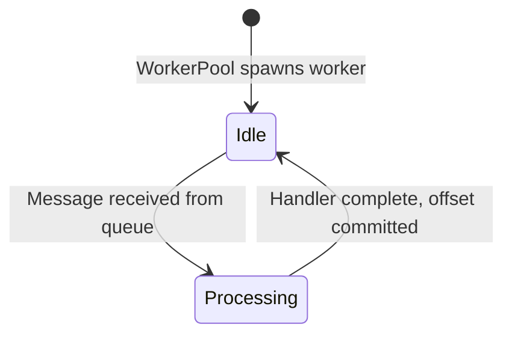
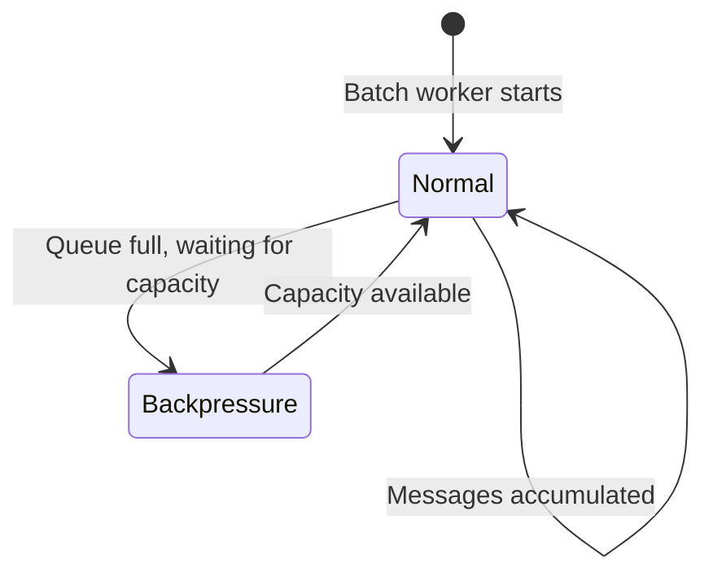

# Phase 01: Code Review Report (Documentation)

**Reviewed:** 2026-04-24
**Depth:** standard
**Files Reviewed:** 8
**Status:** issues_found

## Summary

Phase 01 is a documentation phase covering architecture documents for KafPy. The review checked documentation accuracy against source code, Mermaid diagram syntax, mkdocs configuration validity, and cross-references. Several state machine definitions in the documentation do not match the actual Rust source code, which could mislead readers. mkdocs.yml is valid and all Mermaid diagrams are syntactically correct.

## Critical Issues

### CR-01: WorkerState documentation does not match source

**File:** `docs/architecture/state-machines.md:9-21`
**Issue:** The state diagram shows 6 states (Idle, Processing, Retrying, WaitingForAck, DlqRouting) but the actual `WorkerState` enum in `src/worker_pool/state.rs:13-18` has only 2 states:

```rust
pub enum WorkerState {
    Idle,
    Processing(OwnedMessage),
}
```

The states Retrying, WaitingForAck, and DlqRouting do not exist in the source. The documentation describes a more complex state machine that was never implemented.

**Fix:** Update the state diagram and table to match the actual implementation:



| State | Meaning |
|-------|---------|
| `Idle` | Worker ready to process next message |
| `Processing` | Currently executing Python handler with message in scope |

---

### CR-02: BatchState documentation does not match source

**File:** `docs/architecture/state-machines.md:63-76`
**Issue:** The state diagram shows 6 states (Idle, Accumulating, Flushing, WaitingForAck, RetryRouting, DlqRouting) but the actual `BatchState` enum in `src/worker_pool/state.rs:41-46` has only 2 states:

```rust
pub enum BatchState {
    Normal,       // accumulating messages, flushing on batch full/deadline
    Backpressure, // flushed accumulator, blocking on capacity
}
```

**Fix:** Update the state diagram to match the actual 2-state implementation:



---

## Warnings

### WR-01: RetryCoordinator 3-tuple description incorrect

**File:** `docs/architecture/state-machines.md:119-150`
**Issue:** The documentation shows `RetryState::NotScheduled` and `Scheduled` states and describes a `RetryDecision` struct, but the actual source (`src/retry/retry_coordinator.rs:23-54`) has `RetryState::Retrying` and `RetryState::Exhausted`:

```rust
pub enum RetryState {
    Retrying { topic, partition, offset, attempt, last_failure, first_failure },
    Exhausted { topic, partition, offset, last_failure, first_failure },
}
```

The table describes `(should_retry, should_dlq, delay)` tuple but this is the return value of `record_failure()`, not a stored state.

**Fix:** Update to reflect actual enum variants and clarify that the 3-tuple is the return value of `record_failure()`, not a state stored in RetryState.

### WR-02: RoutingContext headers type mismatch

**File:** `docs/architecture/routing.md:86-106`
**Issue:** The documentation shows:
```rust
pub headers: &'a [(String, Vec<u8>)],
```

But the actual source (`src/routing/context.rs:77`) is:
```rust
pub headers: &'a [(String, Option<Vec<u8>>)],
```

The header value is `Option<Vec<u8>>`, not `Vec<u8>` — headers can be absent.

**Fix:** Update the RoutingContext code example:
```rust
pub struct RoutingContext<'a> {
    pub topic: &'a str,
    pub partition: i32,
    pub offset: i64,
    pub key: Option<&'a [u8]>,
    pub payload: Option<&'a [u8]>,
    pub headers: &'a [(String, Option<Vec<u8>>)],  // value is Option<bytes>
}
```

### WR-03: BackpressurePolicy trait method name mismatch

**File:** `docs/architecture/modules.md:96-106`
**Issue:** The documentation shows:
```rust
pub trait BackpressurePolicy: Send + Sync {
    fn action(&self, handler: &HandlerId, depth: usize) -> BackpressureAction;
}
```

But the actual source (`src/dispatcher/backpressure.rs:42`) is:
```rust
fn on_queue_full(&self, topic: &str, handler: &HandlerMetadata) -> BackpressureAction;
```

The method is `on_queue_full`, not `action`. Also, it takes `HandlerMetadata` not `&HandlerId` and `depth`.

**Fix:** Update to match actual trait signature:
```rust
pub trait BackpressurePolicy: Send + Sync {
    fn on_queue_full(&self, topic: &str, handler: &HandlerMetadata) -> BackpressureAction;
}
```

### WR-04: modules.md describes Executor trait incorrectly

**File:** `docs/architecture/modules.md:128-131`
**Issue:** The documentation says "Executor trait" but the actual trait in `src/python/executor.rs:16-23` has a method `execute()` that takes `ExecutionResult` and returns `ExecutorOutcome`:

```rust
pub trait Executor: Send + Sync {
    fn execute(
        &self,
        ctx: &ExecutionContext,
        _message: &OwnedMessage,
        result: &ExecutionResult,
    ) -> ExecutorOutcome;
}
```

The documentation does not describe the actual trait correctly.

**Fix:** Update to show the correct trait signature and document `ExecutorOutcome`.

---

## Info

### IN-01: modules.md file listing for runtime/ may be incomplete

**File:** `docs/architecture/modules.md:218-231`
**Issue:** The runtime section shows `runtime/builder.rs` with `RuntimeBuilder` and `build()` method but doesn't list other runtime files. Verify if `runtime/mod.rs` and other runtime files need documentation.

**Fix:** Consider adding a file table similar to other modules, or clarify which files are documented.

### IN-02: observability module listing incomplete

**File:** `docs/architecture/modules.md:290-298`
**Issue:** The observability section lists 5 files but the glob shows additional `runtime_snapshot.rs` file exists that is mentioned in the description but not listed in the files table.

**Fix:** Add `runtime_snapshot.rs` to the files table for observability.

### IN-03: coordinator module appears in lib.rs but not documented

**File:** `docs/architecture/modules.md` (missing section)
**Issue:** `src/lib.rs:26` shows `pub(crate) mod coordinator;` but there's no module documentation section for `coordinator/`. The docs cover `offset/` but not the `coordinator` module which is described as a separate offset commit coordinator.

**Fix:** Add a section for `src/coordinator/` module or clarify its relationship to `offset/` module.

---

## mkdocs.yml Review

**No issues found.** The configuration is valid:
- Theme: Material with proper palette configuration
- Plugins: search and mermaid2 (version 10) correctly configured
- Navigation: All documented files properly mapped
- Extensions: All proper PyMdownX extensions for code highlighting

## Mermaid Diagram Review

**All diagrams are syntactically valid.** Verified:
- `overview.md`: Two valid subgraph graphs
- `message-flow.md`: Valid sequenceDiagram and flowchart diagrams
- `state-machines.md`: Valid stateDiagram-v2 diagrams
- `routing.md`: Valid graph and flowchart diagrams
- `pyboundary.md`: Valid flowchart and sequenceDiagram

---

_Reviewed: 2026-04-24_
_Reviewer: the agent (gsd-code-reviewer)_
_Depth: standard_