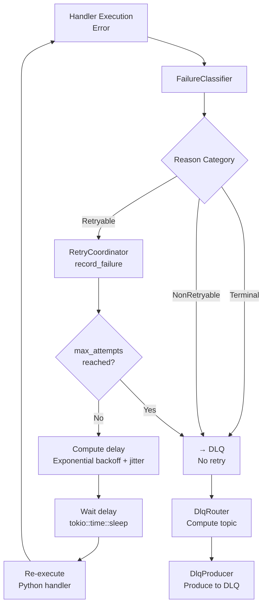

# Architecture Research: Rust-Core, Python-Logic Kafka Consumer Framework

**Date**: 2026-04-28
**Project**: KafPy
**Purpose**: Research and document the architecture for a high-performance Kafka consumer framework with Rust for the runtime core and Python for business logic handlers.

---

## Executive Summary

KafPy implements a **7-layer architecture** where Rust owns the runtime (concurrency, memory management, Kafka protocol) and Python owns business logic (message handlers). The architecture prioritizes:

1. **Memory safety via bounded channels** — backpressure is native to the design
2. **Minimal GIL hold time** — Python calls release the GIL during execution
3. **At-least-once delivery** — highest-contiguous-offset commit semantics
4. **Explicit failure classification** — retry/DLQ routing is first-class

---

## 1. Rust/Python Boundary Structure

### 1.1 Boundary Architecture

```
┌─────────────────────────────────────────────────────────────┐
│                      Python Layer                           │
│  @handler decorator, ConsumerConfig, business logic          │
└─────────────────────────┬───────────────────────────────────┘
                          │ PyO3 boundary (GIL acquired here)
┌─────────────────────────▼───────────────────────────────────┐
│                   PyO3 Binding Layer                        │
│  PyConsumer, PyRetryPolicy, PyFailureCategory, PyMessage     │
└─────────────────────────┬───────────────────────────────────┘
                          │ Internal Rust types (no PyO3)
┌─────────────────────────▼───────────────────────────────────┐
│                    Rust Core (Pure)                         │
│  ConsumerRunner, Dispatcher, WorkerPool, OffsetTracker      │
└─────────────────────────────────────────────────────────────┘
```

### 1.2 GIL Management Strategy

**Critical principle**: GIL is acquired only during actual Python callback execution. All Rust orchestration happens WITHOUT the GIL held.

The boundary uses `spawn_blocking` for sync handlers and `pyo3-async-runtimes` for async handlers:

```rust
// src/python/handler.rs — spawn_blocking pattern
pub async fn invoke(&self, ctx: &ExecutionContext, message: OwnedMessage) -> ExecutionResult {
    let callback = Arc::clone(&self.callback);

    tokio::task::spawn_blocking(move || {
        // GIL acquired automatically when Python::with_gil runs
        Python::attach(|py| {
            let py_msg = message_to_pydict(py, &message, None);
            callback.call(py, (py_msg,), None)
        })
    }).await
}
```

**Key properties**:
- `Arc<Py<PyAny>>` for the callback — GIL-independent, Send+Sync
- `spawn_blocking` moves the task to a dedicated thread pool (not Tokio threads)
- Tokio runtime continues polling other tasks while Python executes
- GIL acquired only inside `Python::attach(|py| ...)` closure

### 1.3 Type Conversion Layers

Data crosses the boundary through explicit conversion stages:

| Python Type | PyO3 Boundary Type | Internal Rust Type |
|-------------|-------------------|-------------------|
| `RetryConfig` | `PyRetryPolicy` | `RetryPolicy` |
| `FailureCategory` | `PyFailureCategory` | `FailureCategory` |
| `dict` (message) | `Py<PyDict>` | `OwnedMessage` |

Conversion happens at the boundary, not deep in core logic. Core modules are PyO3-free and testable without a Python interpreter.

---

## 2. Async Rust Calling Python Callbacks

### 2.1 Two Execution Modes

The framework supports two Python callback invocation patterns:

**Mode 1: Sync via `spawn_blocking`**

For handlers defined as `def handler(msg, ctx)`:

```rust
// Worker invokes via spawn_blocking
let result = python_handler.invoke(ctx, message).await;
// Tokio continues other work while Python executes
```

Flow:
1. Tokio worker loop calls `handler.invoke_mode(ctx, message)`
2. `invoke_mode` dispatches to `invoke()` (sync) or `invoke_async()` (async)
3. For sync: `spawn_blocking` acquires GIL, runs callback, releases GIL
4. Returns `ExecutionResult` — Ok, Error, or Rejected

**Mode 2: Async via `PythonAsyncFuture`**

For handlers defined as `async def handler(msg, ctx)`:

```rust
// src/python/async_bridge.rs — custom CFFI Future bridge
pub struct PythonAsyncFuture {
    coro: Py<PyAny>,  // Python coroutine object
}

impl Future for PythonAsyncFuture {
    fn poll(mut self: Pin<&mut Self>, cx: &mut Context<'_>) -> Poll<Self::Output> {
        Python::attach(|py| {
            // Advance coroutine via send(None) — GIL held transiently
            let result = self.coro.call_method1(py, "send", (py.None(),));
            match result {
                Ok(_) => { cx.waker().wake_by_ref(); Poll::Pending }
                Err(StopAsyncIteration) => Poll::Ready(Ok),
                Err(e) => Poll::Ready(Error(...)),
            }
        })
    }
}
```

### 2.2 Async Bridge Design

The `PythonAsyncFuture` uses `wake_by_ref()` instead of `waker.wake()`:

```rust
// Why wake_by_ref?
// Calling waker.wake() would immediately re-schedule and spin CPU
// wake_by_ref() registers the waker for the NEXT scheduler tick
// This prevents GIL thrashing and CPU starvation
Ok(_val) => {
    cx.waker().wake_by_ref();  // More efficient
    Poll::Pending
}
```

### 2.3 Batch Mode

For high-throughput scenarios, batch handlers receive multiple messages in a single GIL acquisition:

```rust
pub async fn invoke_batch(&self, ctx: &ExecutionContext, messages: Vec<OwnedMessage>) -> BatchExecutionResult {
    let callback = Arc::clone(&self.callback);

    tokio::task::spawn_blocking(move || {
        Python::attach(|py| {
            // Build all message dicts under one GIL hold
            let py_batch: Vec<Py<PyAny>> = messages
                .iter()
                .map(|msg| message_to_pydict(py, msg, None))
                .collect();

            callback.call1(py, (py_batch,))
        })
    }).await
}
```

---

## 3. Backpressure and Memory Bounds

### 3.1 Bounded Channel Architecture

Every handler has its own bounded `mpsc::channel`:

```
┌──────────────────────────────────────────────────────────────┐
│                     ConsumerRunner                           │
│  KafkaStream ──► dispatch(message) ──► mpsc::Sender          │
└──────────────────────────────────────────────────────────────┘
                          │
                          ▼
┌──────────────────────────────────────────────────────────────┐
│                   QueueManager                              │
│  per-handler bounded channels with capacity metadata         │
│  handler_queues: HashMap<HandlerId, BoundedSender<OwnedMessage>>│
└──────────────────────────────────────────────────────────────┘
                          │
                          ▼
┌──────────────────────────────────────────────────────────────┐
│                   WorkerPool                                 │
│  worker_loop ──► mpsc::Receiver ──► PythonHandler.invoke()  │
└──────────────────────────────────────────────────────────────┘
```

**Key invariant**: Each handler queue has a configurable `capacity`. When the channel is full, `try_send` fails.

### 3.2 BackpressurePolicy Trait

The `BackpressurePolicy` trait decides what happens when a queue is full:

```rust
// src/dispatcher/backpressure.rs
pub enum BackpressureAction {
    Drop,                         // Discard message (fire-and-forget)
    Wait,                         // Block sender briefly
    FuturePausePartition(String), // Signal partition pause (future feature)
}

pub trait BackpressurePolicy: Send + Sync {
    fn on_queue_full(&self, topic: &str, handler: &HandlerMetadata) -> BackpressureAction;
}
```

**Built-in policies**:
- `DefaultBackpressurePolicy` — drops messages (acceptable for metrics/logging)
- `PauseOnFullPolicy` — signals partition pause (for critical data)

### 3.3 Memory-Bound Design

The architecture prevents memory blowup through:

1. **Bounded channels per handler** — each handler queue is isolated
2. **Backpressure propagation** — dispatcher consults `BackpressurePolicy` on queue full
3. **Partition pause signal** — `FuturePausePartition` provides a signal to slow Kafka consumption
4. **No unbounded buffers** — every queue has a capacity limit
5. **Offset tracking separate from buffering** — offset state is bounded to partition count, not message count

### 3.4 Production Patterns

Production Kafka consumers handle backpressure through several mechanisms:

| Pattern | Description | KafPy Implementation |
|---------|-------------|---------------------|
| **Channel-based** | Bounded mpsc channels with sender backpressure | `QueueManager` with `BoundedSender` |
| **Credit-based** | Consumer reports available credits to broker | Planned via `FuturePausePartition` |
| **Window-based** | Fixed window of in-flight messages | Worker pool size limits concurrency |
| **Reactive pull** | Consumer pulls batches on demand | Not implemented (rdkafka handles) |

KafPy's approach combines channel-based backpressure with window-based concurrency control via the worker pool.

---

## 4. Offset Tracking and Commit Semantics

### 4.1 At-Least-Once Delivery

KafPy provides **at-least-once delivery** semantics. The framework never commits an offset until:

1. The message has been **acknowledged** by the Python handler
2. All **prior offsets** have also been acknowledged (contiguous)
3. The offset is **stored** explicitly before commit

### 4.2 Highest Contiguous Offset Algorithm

```rust
// src/offset/offset_tracker.rs
pub struct PartitionState {
    pub committed_offset: i64,      // -1 = nothing committed yet
    pub pending_offsets: BTreeSet<i64>,  // awaiting commit
    pub failed_offsets: BTreeSet<i64>,   // failed, not committed
}

pub fn ack(&mut self, offset: i64) {
    self.pending_offsets.insert(offset);

    // Advance contiguous cursor while gaps fill
    loop {
        let next = self.committed_offset + 1;
        if self.pending_offsets.remove(&next) {
            self.committed_offset = next;
        } else {
            break;
        }
    }
}
```

**Key property**: Out-of-order acks are buffered. If offset 10 and 12 are acked before 11, the committed cursor stays at 10 until 11 arrives.

### 4.3 Commit Coordination

The framework uses `enable.auto.offset.store=false` with explicit offset storage:

```rust
// Commit only happens when:
// 1. should_commit() returns true (next offset is pending)
// 2. store_offset() is called first (rdkafka requirement)
// 3. commit() is called to persist
if offset_tracker.should_commit(topic, partition) {
    runner.store_offset(topic, partition, offset);
    runner.commit();
}
```

### 4.4 Terminal Failure Blocking

When a message is classified as `Terminal` (e.g., poison message, deserialization failure), the partition enters a terminal state that blocks further commits:

```rust
// D-01: Terminal blocks commit for this partition only
pub fn should_commit(&self, topic: &str, partition: i32) -> bool {
    guard.get(&key).is_some_and(|s| {
        if s.has_terminal {
            return false;  // Block commit until terminal is flushed
        }
        !s.pending_offsets.is_empty() || s.committed_offset >= 0
    })
}
```

This prevents infinite loops where a poison message is retried, fails, and blocks all progress on the partition.

### 4.5 Offset Commit Semantics Summary

| Property | Value |
|----------|-------|
| Delivery guarantee | At-least-once |
| Commit trigger | Highest contiguous offset acked |
| Out-of-order handling | BTreeSet buffering |
| Terminal blocking | Per-partition (other partitions unaffected) |
| Offset storage | Explicit (not auto-store) |

---

## 5. Retry/DLQ Flow Architecture

### 5.1 Failure Classification

Every Python exception is classified by a `FailureClassifier`:

```rust
// src/failure/classifier.rs
pub enum FailureReason {
    Retryable(RetryableKind),    // NetworkTimeout, BrokerUnavailable, TransientPartitionError
    Terminal(TerminalKind),      // DeserializationFailed, HandlerPanic, PoisonMessage
    NonRetryable(NonRetryableKind), // ValidationError, BusinessLogicError, ConfigurationError
}
```

The `DefaultFailureClassifier` maps Python exception types:

```python
# Pattern matching on exception repr
"TimeoutError" / "timeout" → Retryable(NetworkTimeout)
"KafkaError" / "BrokerTransport" → Retryable(BrokerUnavailable)
"DeserializationError" / "DecodeError" → Terminal(DeserializationFailed)
"PanicException" / "SystemExit" → Terminal(HandlerPanic)
"ValidationError" / "ValueError" → NonRetryable(ValidationError)
```

### 5.2 RetryCoordinator State Machine

The `RetryCoordinator` tracks per-message retry state:

```rust
// src/retry/retry_coordinator.rs
pub enum RetryState {
    Retrying {
        attempt: usize,
        last_failure: FailureReason,
        first_failure: DateTime<Utc>,
    },
    Exhausted {
        last_failure: FailureReason,
        first_failure: DateTime<Utc>,
    },
}
```

**State transitions**:

```
Initial failure → Retrying (if Retryable)
    │
    ├── attempt < max_attempts → Retrying (increment attempt)
    │
    └── attempt >= max_attempts → Exhausted → DLQ
```

### 5.3 Retry/DLQ Decision Flow



### 5.4 Exponential Backoff with Jitter

```rust
// RetryPolicy uses exponential backoff
pub struct RetryPolicy {
    max_attempts: u32,
    base_delay: Duration,
    max_delay: Duration,
    jitter_factor: f64,  // 0.0 to 1.0
}

impl RetrySchedule {
    pub fn next_delay(&self, attempt: usize) -> Duration {
        let exp = 2u64.pow(attempt as u32);
        let delay = self.base_delay * exp;
        let delay = delay.min(self.max_delay);

        // Add jitter: ±jitter_factor * delay
        let jitter = (random() - 0.5) * 2.0 * self.jitter_factor * delay.as_secs_f64();
        Duration::from_secs_f64(delay.as_secs_f64() + jitter)
    }
}
```

### 5.5 DLQ Routing

The `DlqRouter` trait computes the DLQ destination:

```rust
// src/dlq/router.rs
pub trait DlqRouter: Send + Sync {
    fn route(&self, metadata: &DlqMetadata) -> TopicPartition;
}

// Default: DLQ topic = dlq_topic_prefix + original_topic
pub struct DefaultDlqRouter { dlq_topic_prefix: String }

impl DlqRouter for DefaultDlqRouter {
    fn route(&self, metadata: &DlqMetadata) -> TopicPartition {
        let topic = format!("{}{}", self.dlq_topic_prefix, metadata.original_topic);
        TopicPartition::new(topic, metadata.original_partition)
    }
}
```

**DlqMetadata envelope**:

```rust
pub struct DlqMetadata {
    pub original_topic: String,
    pub original_partition: i32,
    pub original_offset: i64,
    pub failure_reason: String,
    pub attempt_count: u32,
    pub first_failure: DateTime<Utc>,
    pub last_failure: DateTime<Utc>,
}
```

### 5.6 Shutdown Flush

During graceful shutdown, failed messages are flushed to DLQ before final commit:

```rust
// WorkerPool shutdown sequence:
1. Stop accepting new messages
2. Wait for in-flight to complete (or timeout)
3. flush_failed_to_dlq() — produce all failed offsets to DLQ
4. graceful_shutdown() — commit highest contiguous offsets
```

---

## Component Boundaries

### Component Dependency Graph

```
Python API (@handler, ConsumerConfig)
        │
        ▼
PyO3 Boundary (PyConsumer, PyHandler, PyRetryPolicy)
        │
        ▼
┌───────────────────────────────────────────────────────────────┐
│                    Rust Core (PyO3-free)                      │
│                                                               │
│  ┌─────────────┐  ┌─────────────┐  ┌─────────────────────┐  │
│  │   Kafka     │  │   Queue     │  │      Routing        │  │
│  │   Consumer  │──│   Manager   │──│   (RoutingChain)    │  │
│  └─────────────┘  └─────────────┘  └─────────────────────┘  │
│         │                │                    │              │
│         ▼                ▼                    ▼              │
│  ┌─────────────────────────────────────────────────────┐    │
│  │                  WorkerPool                          │    │
│  │  worker_loop ──► PythonHandler.invoke() ──► Result  │    │
│  └─────────────────────────────────────────────────────┘    │
│                          │                                  │
│         ┌────────────────┼────────────────┐                 │
│         ▼                ▼                ▼                 │
│  ┌────────────┐  ┌────────────┐  ┌────────────┐           │
│  │   Offset   │  │   Retry    │  │     DLQ    │           │
│  │  Tracker   │  │ Coordinator│  │   Router   │           │
│  └────────────┘  └────────────┘  └────────────┘           │
└───────────────────────────────────────────────────────────────┘
        │
        ▼
  rdkafka (C library)
```

### Module Responsibilities

| Module | Responsibility | Public API |
|--------|---------------|------------|
| `consumer/` | Kafka message ingestion, partition management | `ConsumerRunner` |
| `dispatcher/` | Topic routing to handler queues, backpressure | `Dispatcher`, `QueueManager` |
| `worker_pool/` | Worker loop, batch accumulation | `WorkerPool`, `batch_worker_loop` |
| `python/` | GIL boundary, Python callback invocation | `PythonHandler`, `ExecutionContext` |
| `routing/` | Topic/header/key routing chain | `RoutingChain`, `Router` trait |
| `offset/` | Per-partition offset tracking, commit | `OffsetTracker`, `OffsetCoordinator` |
| `retry/` | Retry state machine, backoff | `RetryCoordinator`, `RetryPolicy` |
| `dlq/` | Dead letter queue routing, production | `DlqRouter`, `DlqProducer` |
| `failure/` | Exception classification | `FailureClassifier`, `FailureReason` |
| `observability/` | Metrics, tracing | `MetricsSink`, `TracingSink` |

---

## Data Flow

### Message Flow (Happy Path)

```
1. Kafka ──► ConsumerRunner::next() ──► OwnedMessage
2. ConsumerRunner ──► Dispatcher::dispatch(message)
3. Dispatcher ──► QueueManager::check_queue_depth()
4. Dispatcher ──► BackpressurePolicy::on_queue_full()
5. Dispatcher ──► mpsc::Sender::try_send(message)
6. ConsumerRunner continues polling Kafka

7. WorkerPool ──► mpsc::Receiver::recv() ──► OwnedMessage
8. WorkerPool ──► RoutingChain::route(message) ──► HandlerId
9. WorkerPool ──► PythonHandler::invoke_mode(ctx, message)
10. PythonHandler ──► spawn_blocking ──► Python callback
11. Python callback returns HandlerResult

12. On Success:
    WorkerPool ──► OffsetTracker::ack(topic, partition, offset)
    OffsetTracker advances committed_offset cursor
    Commit task ──► store_offset + commit

13. On Retryable:
    WorkerPool ──► RetryCoordinator::record_failure()
    RetryCoordinator returns (retry, delay)
    WorkerPool ──► tokio::time::sleep(delay)
    WorkerPool retries step 9

14. On Terminal/Exhausted:
    WorkerPool ──► DlqRouter::route()
    WorkerPool ──► DlqProducer::produce_async()
```

### Control Flow (Rebalance/Shutdown)

```
Rebalance Event (partition revoked):
1. rdkafka callback triggers rebalance notification
2. WorkerPool pauses processing for affected partitions
3. OffsetTracker flushes pending offsets for revoked partitions
4. ConsumerRunner revokes partitions
5. rdkafka re-assigns partitions to other consumers

Graceful Shutdown:
1. ShutdownCoordinator::begin_shutdown()
2. ConsumerRunner stops polling
3. WorkerPool drains in-flight messages (with timeout)
4. RetryCoordinator.flush_failed_to_dlq()
5. OffsetTracker.graceful_shutdown() commits final offsets
6. All resources released
```

---

## Suggested Build Order

### Phase 1: Core Engine (PyO3-free)

Build the pure Rust core without Python bindings.

**Dependencies**: None (self-contained)

```
1.1. consumer/ — Kafka ingestion via rdkafka-sys
    - ConsumerRunner, partition management
    - Message deserialization

1.2. dispatcher/ — Bounded channel dispatch
    - QueueManager with HashMap<HandlerId, BoundedSender>
    - BackpressurePolicy trait

1.3. worker_pool/ — Worker loop
    - WorkerPool, worker_loop function
    - State machines: WorkerState, BatchState

1.4. offset/ — Offset tracking
    - OffsetTracker with BTreeSet buffering
    - Commit coordination
```

**Verification**: Unit tests with mock Kafka, no Python interpreter required.

### Phase 2: Python Boundary

Add PyO3 bindings and Python handler invocation.

**Dependencies**: Phase 1 complete

```
2.1. python/handler.rs — GIL boundary
    - PythonHandler with Arc<Py<Any>>
    - spawn_blocking invocation
    - PythonAsyncFuture for async handlers

2.2. python/context.rs — ExecutionContext
    - Trace context injection
    - Message dict conversion

2.3. routing/ — Routing chain
    - TopicPattern, HeaderRouter, KeyRouter
    - RoutingChain with pluggable stages
```

**Verification**: Integration tests with Python test scripts.

### Phase 3: Failure Handling

Add retry and DLQ infrastructure.

**Dependencies**: Phase 1 complete (offset tracking required)

```
3.1. failure/ — Exception classification
    - FailureReason enum
    - DefaultFailureClassifier

3.2. retry/ — Retry coordinator
    - RetryCoordinator state machine
    - Exponential backoff with jitter

3.3. dlq/ — Dead letter queue
    - DlqRouter trait
    - DlqProducer
    - DlqMetadata envelope
```

**Verification**: Unit tests for state transitions, DLQ routing tests.

### Phase 4: Observability

Add metrics and tracing.

**Dependencies**: Phase 1 complete

```
4.1. observability/metrics.rs — Prometheus metrics
    - Message throughput, latency histograms
    - Queue depth gauges
    - Offset lag metrics

4.2. observability/tracing.rs — OpenTelemetry tracing
    - W3C trace context propagation
    - Span per handler execution
```

### Phase 5: Python API

Build the Python-first developer API.

**Dependencies**: Phases 1-3 complete

```
5.1. kafpy/consumer.py — @handler decorator
    - Handler registration
    - Topic subscription

5.2. kafpy/config.py — Configuration
    - ConsumerConfig dataclass
    - RetryConfig, ObservabilityConfig

5.3. kafpy/runtime.py — Runtime startup
    - RuntimeBuilder wiring
    - Graceful shutdown
```

**Verification**: End-to-end tests with real Kafka cluster.

---

## Quality Gates Verification

- [x] **Components clearly defined with boundaries**: Each module has explicit responsibility and a narrow public API. The PyO3 boundary is isolated — core modules contain no PyO3 types.

- [x] **Data flow direction explicit**: The happy-path flow (Kafka -> Consumer -> Dispatcher -> Worker -> Python -> Offset) is documented with numbered steps. Control flow for rebalance/shutdown is separate.

- [x] **Build order implications noted**: Four phases with explicit dependencies. Phase 1 (core engine) is PyO3-free and testable without Python. Each phase builds on verified previous phases.

---

## References

- [rdkafka documentation](https://docs.confluent.io/platform/current/clients/librdkafka/html/index.html)
- [PyO3 user guide](https://pyo3.rs/)
- [tokio spawn_blocking](https://docs.rs/tokio/latest/tokio/task/fn.spawn_blocking.html)
- [At-least-once delivery pattern](https://aws.amazon.com/blogs/architecture/reliable-messaging-for-serverless-applications/)
- [Exponential backoff with jitter](https://aws.amazon.com/blogs/architecture/exponential-backoff-and-jitter/)
