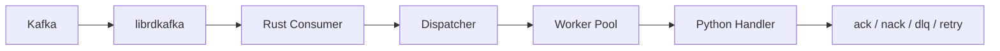

# KafPy

[](https://www.python.org/)
[](https://www.rust-lang.org/)
[](LICENSE)

A Python Kafka library built with Rust and PyO3 for high-performance message consumption.

## Overview

KafPy provides a handler-based API for building Kafka consumers in Python. It combines Rust's performance for the Kafka core with a clean Python interface for writing business logic.

**Key capabilities:**

- Signal-driven offset commits with interval/batch throttle
- Sync handlers (async not supported — raises TypeError)
- Batch message processing via `@app.batch_handler()` decorator
- Built-in retry and dead-letter queue (DLQ) support
- Prometheus metrics and OTLP tracing
- Middleware for logging, metrics, and custom extensions

## Architecture

KafPy uses a Rust core for high-performance message ingestion with a Python API for handler logic.



### Key characteristics:

- **Rust core**: Handles Kafka protocol, message batching, offset tracking, and worker threads
- **Python handlers**: Execute in worker threads (GIL applies)
- **No async support**: Async def handlers raise TypeError — use sync handlers

## Quick Start

```python
import kafpy

config = kafpy.ConsumerConfig(
    bootstrap_servers="localhost:9092",
    group_id="my-group",
    topics=["my-topic"],
)

consumer = kafpy.Consumer(config)
app = kafpy.KafPy(consumer)

@app.handler(topic="my-topic")
def handle(msg: kafpy.KafkaMessage, ctx: kafpy.HandlerContext) -> kafpy.HandlerResult:
    print(f"Received: {msg.key} @ {ctx.topic}:{ctx.partition}:{ctx.offset}")
    return kafpy.HandlerResult(action="ack")

app.start()
```

## What KafPy does NOT do

- **Async handlers are not supported** — `async def` handlers raise `TypeError`. Use synchronous handlers.
- **No `run()` method** — use `app.start()` instead.
- **No `batch=True` parameter** — use the `@app.batch_handler()` decorator for batch processing.

## Installation

### Prerequisites

- Python 3.11+
- Rust toolchain
- `librdkafka`

**Install `librdkafka` before building:**

```bash
# macOS
brew install librdkafka

# Ubuntu / Debian
apt install librdkafka-dev

# Fedora
dn install librdkafka-devel
```

### From PyPI

```bash
pip install kafpy
```

### From source

```bash
git clone https://github.com/DVNghiem/KafPy.git
cd KafPy
pip install maturin
maturin develop --release
```

## Full Documentation

Detailed guides and API reference are available at the [KafPy documentation site](https://DVNghiem.github.io/KafPy/).

| Guide | Description |
|-------|-------------|
| [Getting Started](https://DVNghiem.github.io/KafPy/docs/tutorial/) | Build your first Kafka consumer |
| [Configuration](https://DVNghiem.github.io/KafPy/docs/installation/) | Consumer and retry configuration |
| [Handlers](https://DVNghiem.github.io/KafPy/docs/guides/) | Writing sync and batch handlers |
| [Error Handling](https://DVNghiem.github.io/KafPy/docs/best-practices/) | Retry, DLQ, and timeout strategies |
| [API Reference](https://DVNghiem.github.io/KafPy/docs/api/) | Full API documentation |

## License

BSD-3-Clause. See `LICENSE`.
