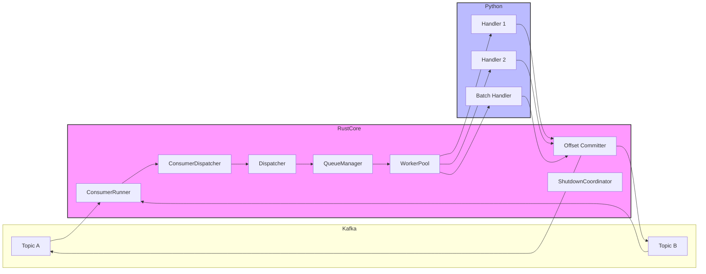
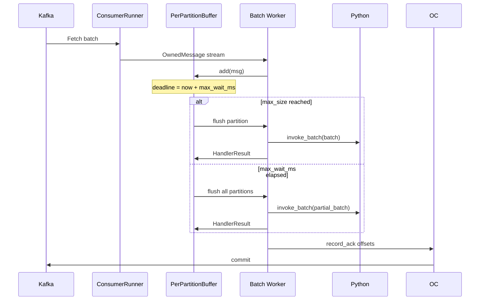
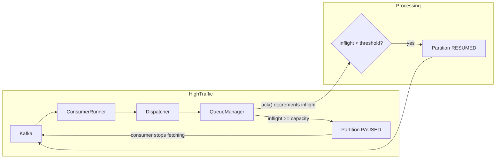
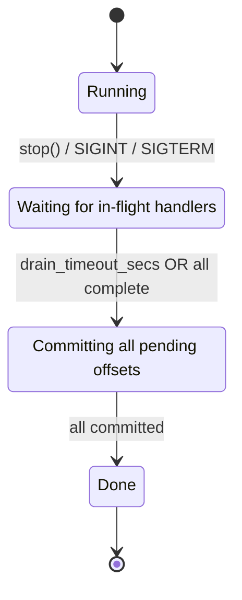

# KafPy Architecture

Internal architecture documentation for KafPy's message processing pipeline.

## Overview

KafPy is a Python library for building Kafka consumers. The consumer core is written in Rust, providing:
- High-performance message ingestion from librdkafka
- Automatic backpressure via partition pausing
- Batched processing with configurable flush triggers
- Graceful shutdown with guaranteed offset commit
- Retry with exponential backoff and DLQ routing

Python handlers are synchronous functions invoked via PyO3 with the GIL held. Tokio is used internally for the Rust async runtime, but Python handlers are sync callbacks — they do not run as async coroutines.

---

## 1. Message Lifecycle

```
Kafka → librdkafka → ConsumerRunner → ConsumerDispatcher → Dispatcher → WorkerPool → Python Handler → HandlerResult → Offset Committer
```

### Lifecycle Stages

| Stage | Component | Description |
|-------|-----------|-------------|
| 1 | **Kafka** | Produces messages to topic partitions |
| 2 | **librdkafka** | Fetches batches via `rd_kafka_consume_batch()` |
| 3 | **ConsumerRunner** | Wraps rdkafka consumer, produces `OwnedMessage` stream |
| 4 | **ConsumerDispatcher** | Routes messages to per-handler channels, enforces backpressure |
| 5 | **Dispatcher** | Bounded `mpsc::channel` with queue depth tracking |
| 6 | **WorkerPool** | Tokio tasks polling handler channels |
| 7 | **Python Handler** | User-defined callback invoked via PyO3 |
| 8 | **HandlerResult** | `Ok` / `Error` / `Rejected` / `Timeout` enum |
| 9 | **Offset Committer** | Throttled `store_offset` + `commit` to Kafka |

### Mermaid: Message Flow



---

## 2. Worker Pool and Concurrency

### Structure

```
WorkerPool (JoinSet<tokio::Task>)
  ├── Worker 0 ─── polls mpsc::Receiver (topic A)
  ├── Worker 1 ─── polls mpsc::Receiver (topic A)
  ├── Worker 2 ─── polls mpsc::Receiver (topic B)
  └── Worker 3 ─── polls mpsc::Receiver (topic B)
```

- Default: **4 worker tasks** (configurable via `num_workers`)
- Each worker polls its own `mpsc::Receiver` via `tokio::select!`
- Workers are ** Tokio tasks**, not threads — GIL is released during Python calls

### Per-Handler Concurrency

The `concurrency` parameter on `add_handler()` sets a `Semaphore(permits=N)` per handler:

```python
consumer.add_handler("my-topic", handler, concurrency=10)
```

- Semaphore limits concurrent dispatches **per worker pool**
- Default concurrency: **4** (from `KAFPY_HANDLER_CONCURRENCY_DEFAULT` or `num_workers`)
- A message waits for a permit before entering the channel

### GIL Implications

Python handlers are invoked via PyO3 with the GIL held. Key implications:

| Handler Type | GIL Behavior |
|-------------|--------------|
| **sync** | GIL held for entire handler execution |
| **batch_sync** | GIL held for entire batch callback |

**Important**: `async def` handlers are NOT supported. Using `@app.handler` on an async function raises `TypeError`.

**For I/O-bound handlers**: Since handlers are sync, consider using `concurrent.futures.ThreadPoolExecutor` or `multiprocessing` for parallelism if needed.

**For CPU-bound handlers**: GIL serializes Python execution. True parallelism requires `multiprocessing` (separate processes).

---

## 3. Batch Accumulation and Flush

Batch handlers (`batch_sync` only — `batch_async` is not supported) accumulate messages per partition before invoking the Python callback.

### Accumulator Logic

```rust
struct PerPartitionBuffer {
    messages: Vec<OwnedMessage>,
    deadline: Option<Instant>,  // Fixed-window: set once on first message
}
```

**Fixed-window timer**: The deadline is set on the **first** message arrival and does not reset on subsequent messages. This prevents timer reset storms under burst traffic.

### Flush Triggers

A batch is flushed when **either** trigger fires:

| Trigger | Description |
|---------|-------------|
| `max_size` reached | Partition buffer hits configured max messages |
| `max_wait_ms` elapsed | Fixed window timer expires |

### Batch Worker Loop (`tokio::select!`)



### Batch Execution Result

```rust
enum BatchExecutionResult {
    AllSuccess(Vec<i64>),   // All messages succeeded — ack all offsets
    AllFailure(FailureReason), // Entire batch failed — route all to DLQ
}
```

**Important**: A batch returns a **single result for all messages**. If the handler raises an exception, the entire batch is treated as failed. There is no partial-batch success.

---

## 4. Backpressure Mechanism

Backpressure prevents the Rust consumer from overwhelming the Python worker pool.

### In-Flight Tracking

`QueueManager` tracks two counters per handler:

| Counter | Meaning |
|---------|---------|
| `queue_depth` | Messages buffered in the mpsc channel |
| `inflight` | Messages dispatched but not yet acked |

### Flow

```
Message arrives → Dispatcher.try_send() → queue_depth++, inflight++

Handler succeeds → queue_manager.ack() → queue_depth--, inflight--
Handler fails → same (ack always called to avoid counter leaks)
```

### Partition Pause/Resume

When `inflight >= capacity`, the dispatcher returns `BackpressureAction::PausePartition`:

```rust
// In ConsumerDispatcher::run()
Err(DispatchError::Backpressure { .. }) => {
    self.pause_partition(&pause_topic);
    self.paused_topics.lock().insert(pause_topic.clone());
}
```

**Resume** happens when queue depth drops below 50% of capacity (hardcoded `resume_threshold = 0.5`):

```rust
fn check_resume(&self, topic: &str, current_depth: usize) {
    let threshold = (capacity as f64 * 0.5) as usize;
    if current_depth < threshold && self.paused_topics.lock().remove(topic) {
        self.resume_partition(topic);
    }
}
```

### Mermaid: Backpressure Flow



### Semaphore vs. Queue Full

Two backpressure signals exist:

1. **Semaphore exhausted**: `try_acquire_semaphore()` returns `false` — per-handler concurrency limit reached
2. **Queue full**: `try_send()` returns `TrySendError::Full` — channel buffer exhausted

Both emit `BackpressureAction::PausePartition` with the topic name.

---

## 5. Offset Commit Architecture

### Two-Phase Commit

KafPy uses a **signal-driven** commit architecture:

1. **Signal**: `ack()` in the worker triggers `offset_tracker.ack()` which sends on a `watch::Sender`
2. **Committer task**: Listens on the watch channel and evaluates throttle conditions

### OffsetTracker

Per-topic-partition state machine:

```rust
struct PartitionState {
    committed_offset: i64,      // Last contiguous committed offset
    pending_offsets: BTreeSet<i64>,  // Out-of-order buffering
    failed_offsets: BTreeSet<i64>,  // Failed messages (not committed)
}
```

**Algorithm** (`ack`):
1. Insert offset into `pending_offsets`
2. While `committed_offset + 1` is in `pending_offsets`, remove it and increment `committed_offset`
3. This handles out-of-order acks — message 5 can be acked before message 4

### Committer Throttle

```rust
struct CommitConfig {
    commit_interval_ms: 100,      // Minimum interval between commits
    commit_max_messages: 100,     // Batch threshold
}
```

Commit fires when **either** condition is met:
- 100ms has elapsed since last commit
- 100 messages have been acked since last commit

A 100ms interval tick is always running as a **safety net** in case signals are missed.

### Graceful Shutdown Commit

During the `Finalizing` phase, the committer:

1. Receives the finalization signal from `ShutdownCoordinator`
2. Processes all ready partitions
3. Exits

```mermaid
flowchart TB
    A[Running] --> B{stop() / SIGINT}
    B --> C[Draining]
    C --> |"drain_timeout OR all complete"| D[Finalizing]
    D --> |"all offsets committed"| E[Done]

    style D fill:#ff9
    style E fill:#9f9
```

---

## 6. Shutdown Lifecycle

The shutdown coordinator enforces a strict 4-phase state machine:



### Phase Details

| Phase | Description | Exit Condition |
|-------|-------------|----------------|
| **Running** | Normal message processing | `stop()` called or signal received |
| **Draining** | Workers finish in-flight work | All workers complete **or** `drain_timeout_secs` elapses |
| **Finalizing** | `graceful_shutdown()` commits all pending offsets | All offsets committed |
| **Done** | Consumer closed | `set_done()` called |

### Shutdown Sequence

```rust
// In WorkerPool::shutdown()
pub async fn shutdown(&mut self) {
    self.shutdown_token.cancel();  // Signal all workers to stop

    // Drain workers with timeout
    match tokio::time::timeout(drain_timeout, self.join_set.shutdown()).await {
        Ok(()) => { /* graceful */ }
        Err(_) => { self.join_set.abort_all(); }  // Forced
    }

    // Flush failed to DLQ before final commit
    self.offset_coordinator.flush_failed_to_dlq(...);

    // Final offset commit
    self.offset_coordinator.graceful_shutdown();

    // Signal finalizing → done
    self.coordinator.begin_finalizing();
    self.coordinator.set_done();
}
```

### Drain Timeout

- Default: **30 seconds** (configurable via `drain_timeout_secs`)
- If workers don't drain within the timeout, they are forcibly aborted
- In-flight messages that were never acked will **not** be committed (gap remains)

---

## 7. Retry and DLQ Flow

### Failure Classification

```rust
enum FailureReason {
    Retryable(RetryableKind),   // NetworkTimeout, TransientError, etc.
    Terminal(TerminalKind),      // DeserializationFailed, HandlerPanic, etc.
}
```

**Terminal failures** skip retry and go directly to DLQ.

### RetryCoordinator

Tracks retry state per `(topic, partition, offset)`:

```rust
enum RetryState {
    Retrying { attempt: usize },  // Currently retrying
    Exhausted,                    // Max attempts exceeded → DLQ
}
```

### Retry Flow

```
Handler returns Error
  → RetryCoordinator.record_failure(topic, partition, offset, reason)
  → If retryable and attempt < max_attempts:
      → Sleep for backoff delay (cancellable by shutdown)
      → Re-process message (NOT re-dispatched — re-processed inline)
      → record_success on ack
  → If attempt >= max_attempts OR terminal:
      → Route to DLQ
      → offset_coordinator.mark_failed()
```

### Backoff Schedule

```rust
struct RetrySchedule {
    base_delay: 100ms,
    max_delay: 30s,
    jitter_factor: 0.1,
}

// Formula: min(base_delay * 2^attempt, max_delay) * (1 - jitter_factor + rng * jitter_factor * 2)
```

Default: 3 attempts with 100ms base → delays of ~100ms, ~200ms, ~400ms (with ±10% jitter).

### DLQ Routing

DLQ topic: `{dlq_topic_prefix}{original_topic}`

Default prefix: `"dlq."`

Example: `"my-topic"` → `"dlq.my-topic"`

### Batch Mode Retry

Batch handlers do **not** support inline retry (sleeping blocks the worker). Instead, failed batches go **directly to DLQ**:

```rust
// In batch_worker_loop handle_batch_result_inline
BatchExecutionResult::AllFailure(reason) => {
    for msg in batch {
        let (should_retry, should_dlq, _delay) =
            retry_coordinator.record_failure(topic, partition, msg.offset, &reason);
        // In batch mode: retryable failures are treated the same as terminal
        if should_dlq || should_retry {
            dlq_producer.produce_async(...);
        }
    }
}
```

---

## 8. GIL Implications for Python Handlers

### PyO3 Invocation Pattern

```rust
// In PythonHandler::invoke_mode_sync
py.allow_threads(|| {
    // GIL is RELEASED here during Python call
    let result = callback.call1(...);
});
// GIL is re-acquired here
```

### Concurrency Summary

| Configuration | Parallel Python Execution? |
|--------------|--------------------------|
| 1 worker, 1 handler, sync mode | No — GIL held |
| 4 workers, 4 handlers, sync mode | No — GIL held per worker |

**Note**: Async handlers are NOT supported. `async def` handlers raise `TypeError`.

### Recommendations

**For I/O-bound handlers** (network calls, file I/O):
- Use threads (`concurrent.futures.ThreadPoolExecutor`) or processes (`multiprocessing`) for parallelism
- Do NOT use `async def` — it raises `TypeError`

**For CPU-bound handlers**:
- GIL serializes Python execution
- True parallelism requires `multiprocessing` (separate processes)

---

## 9. Key Files Reference

| File | Responsibility |
|------|----------------|
| `src/consumer/runner.rs` | Kafka consumer stream via librdkafka |
| `src/dispatcher/consumer_dispatcher.rs` | Message routing + backpressure pause/resume |
| `src/dispatcher/dispatcher.rs` | Per-handler channel management |
| `src/dispatcher/queue_manager.rs` | Queue depth + inflight tracking |
| `src/worker_pool/pool.rs` | Tokio task pool lifecycle |
| `src/worker_pool/worker.rs` | Single-message worker loop |
| `src/worker_pool/batch_loop.rs` | Batch accumulator + flush logic |
| `src/offset/offset_tracker.rs` | Per-partition offset state machine |
| `src/offset/commit_task.rs` | Background committer task |
| `src/retry/retry_coordinator.rs` | Per-message retry state |
| `src/dlq/router.rs` | DLQ topic computation |
| `src/shutdown/shutdown.rs` | 4-phase shutdown coordinator |
