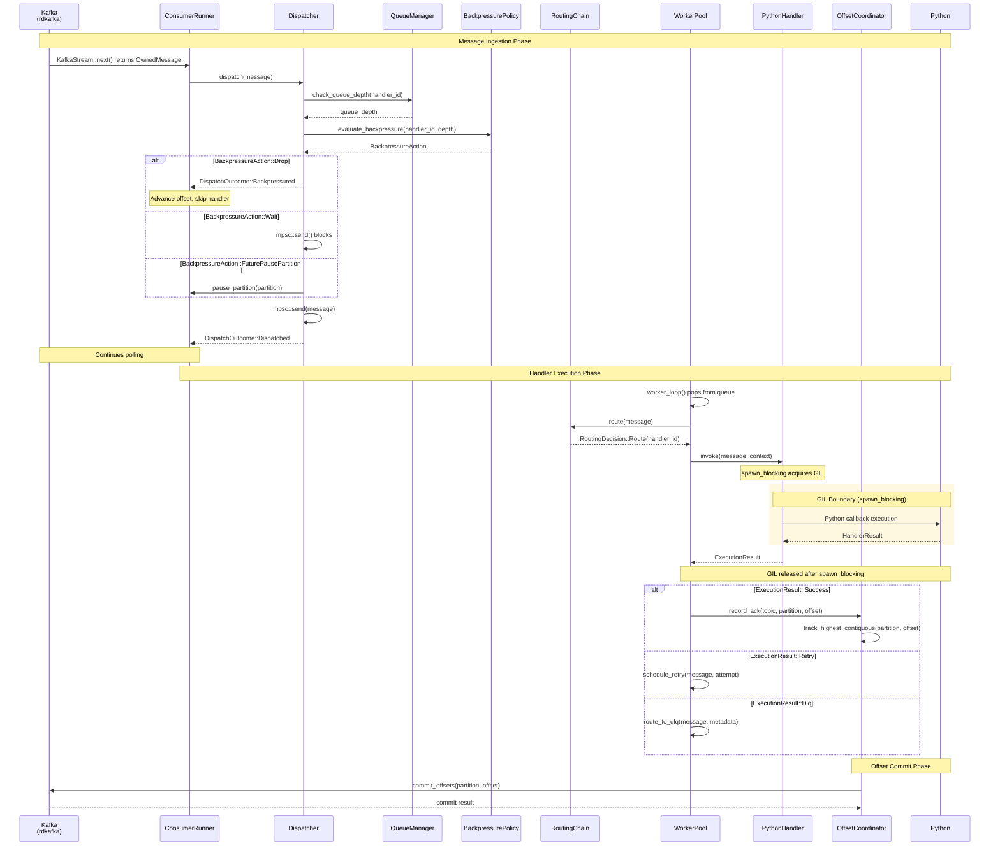
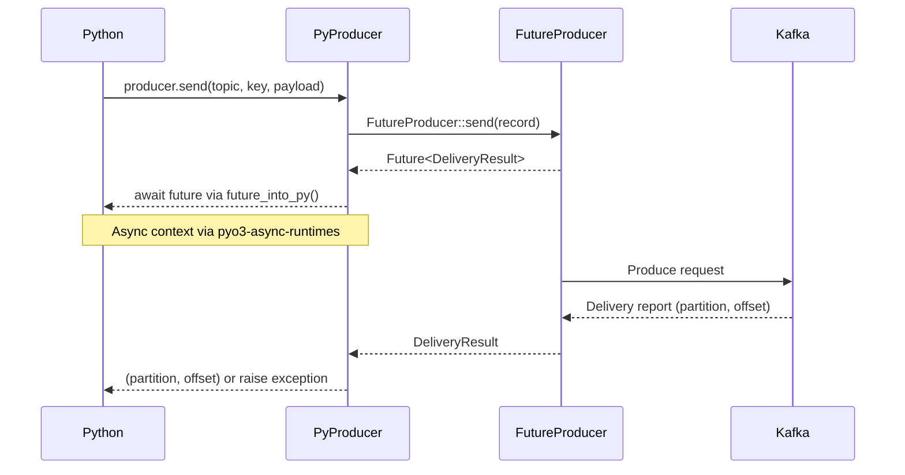
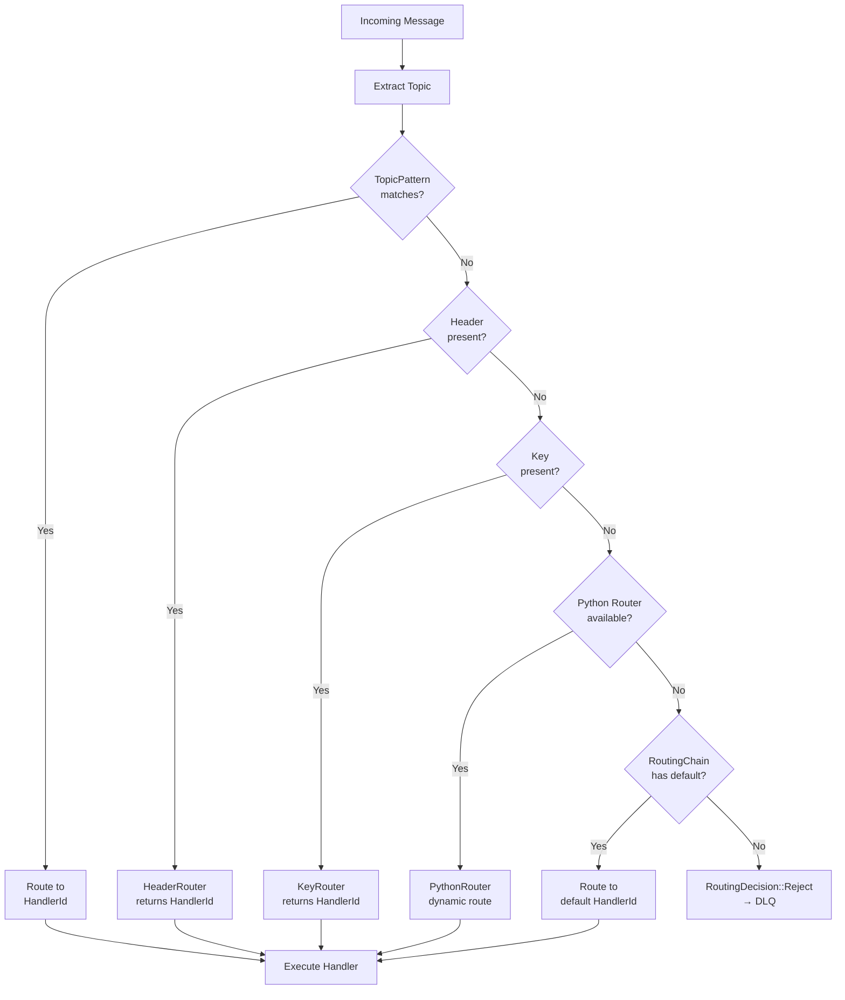
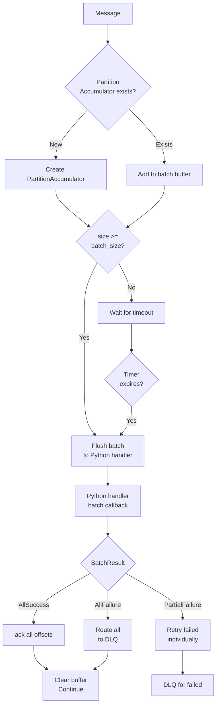
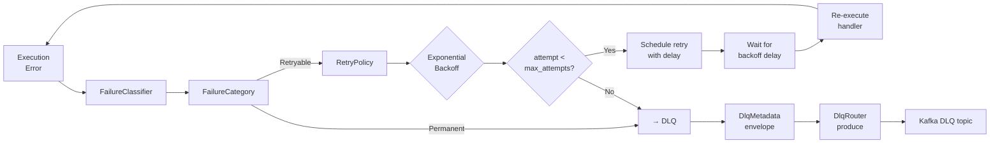

# Message Flow

## Consumer Message Flow

Detailed flow from Kafka message arrival to Python handler execution and offset commit.

## Producer Message Flow

## Routing Chain Precedence

## Batch Handler Flow

## Retry/DLQ Flow

