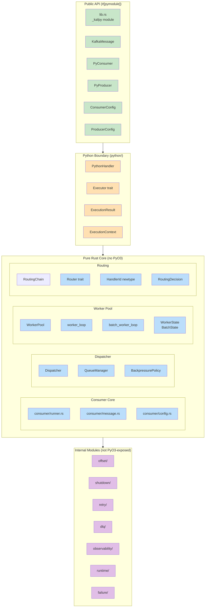

# Architecture Overview

## High-Level Architecture

KafPy is a PyO3 native extension where Rust provides the runtime/core engine and Python holds the business logic.

```mermaid
graph TB
    subgraph Python["Python Layer (kafpy/)"]
        PYC[Consumer<br/>Producer<br/>Config]
    end

    subgraph PyO3["PyO3 Binding Layer (_kafpy)"]
        PYO3[lib.rs<br/>#[pymodule] _kafpy]
    end

    subgraph RustCore["Rust Core (src/)"]
        CONS[consumer/]
        DISP[dispatcher/]
        WORK[worker_pool/]
        ROUT[routing/]
        OFF[offset/]
        SHDN[shutdown/]
        RETRY[retry/]
        DLQ[dlq/]
        OBS[observability/]
        PY[runtime/<br/>python/]
    end

    subgraph Kafka["Kafka (rdkafka)"]
        KAFKA[Bootstrap Servers]
    end

    Python --> PyO3
    PyO3 --> RustCore
    RustCore --> Kafka
    Kafka --> RustCore

    style Python fill:#f5f5f5
    style PyO3 fill:#fff3e0
    style RustCore fill:#e3f2fd
    style Kafka fill:#ffecb3
```

## Module Organization



## Key Design Decisions

| Decision | Rationale | Location |
|----------|-----------|----------|
| Rust core / Python business logic | Performance + idiomatic bindings | src/lib.rs |
| rdkafka for Kafka protocol | Battle-tested, async-capable | Cargo.toml |
| Tokio for async runtime | Native rdkafka compat, mpsc channels | Cargo.toml |
| PyO3-free consumer core | Clean separation, testable without Python | src/consumer/ |
| Per-topic bounded queue dispatch | Isolated backpressure per topic | src/dispatcher/ |
| BackpressurePolicy trait | Extensible backpressure (Drop/Wait/FuturePausePartition) | src/dispatcher/backpressure.rs |
| Executor trait | Future retry/commit/async/batch policies plug in here | src/python/executor.rs |
| OffsetCoordinator trait | Separates offset tracking from Executor policy | src/offset/offset_coordinator.rs |
| Highest contiguous offset commit | Only commit when all prior offsets acked | src/offset/offset_tracker.rs |
| store_offset + commit coordination | enable.auto.offset.store=false, explicit coordination | src/offset/ |
| RetryCoordinator 3-tuple | (should_retry, should_dlq, delay) controls retry and DLQ routing | src/retry/retry_coordinator.rs |
| HandlerId newtype wrapper | Prevents accidental interchange with topic names | src/routing/context.rs |