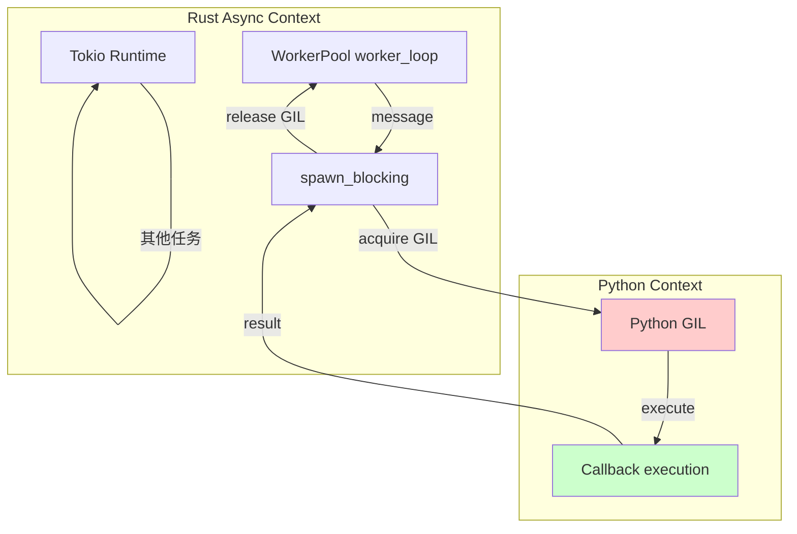

# PyO3 Boundary

Documentation of the GIL boundary, async bridges, and type conversions between Rust and Python.

## GIL Management Strategy

Python's Global Interpreter Lock (GIL) prevents concurrent Python code execution. KafPy minimizes GIL hold time by:

1. **All Python calls go through `spawn_blocking`** — Releases GIL during Python execution
2. **Rust async continues during Python calls** — Other tasks progress while waiting
3. **No GIL held across Rust orchestration** — GIL only acquired for actual Python calls



## spawn_blocking Pattern

```rust
// python/handler.rs
impl PythonHandler {
    pub async fn execute(
        &self,
        message: OwnedMessage,
        context: ExecutionContext,
    ) -> ExecutionResult {
        let py_callback = self.callback.clone();

        tokio::task::spawn_blocking(move || {
            // GIL acquired here automatically
            Python::with_gil(|py| {
                let result = py_callback.call1(py, (/* args */));
                // GIL released when closure returns
            })
        })
        .await
        .map_err(|_| ExecutionError::TaskCancelled)?
    }
}
```

## Async/Sync Bridge

KafPy uses `pyo3-async-runtimes` to bridge Python async with Rust Tokio:

```mermaid
sequenceDiagram
    participant P as Python<br/>async def handler
    participant PA as PythonAsyncFuture
    participant T as Tokio Runtime
    participant K as Kafka

    Note over P: Python async def handler(msg):
        return await process(msg)

    P->>PA: Create future via PEP-492
    PA->>T: future_into_py() registers with Tokio
    T->>K: Kafka message arrives
    K-->>T: OwnedMessage
    T->>PA: poll() called
    PA->>P: Python coroutine advances
    P-->>PA: await yields
    PA-->>T: Poll::Pending
    T->>T: yield to other tasks
    T->>PA: poll() called again
    PA->>P: Python coroutine completes
    P-->>PA: result
    PA-->>T: Poll::Ready(result)
```

## Type Conversions

### Rust → Python

```rust
use pyo3::prelude::*;

// Rust struct becomes Python class
#[pyclass]
pub struct KafkaMessage {
    #[pyo3(get)]
    topic: String,
    #[pyo3(get)]
    partition: i32,
    #[pyo3(get)]
    offset: i64,
    #[pyo3(get)]
    payload: Option<Vec<u8>>,
}

// Rust error becomes Python exception
fn risky_operation() -> PyResult<i32> {
    Err(PyErr::new::<pyo3::exceptions::PyValueError, _>("invalid input"))
}
```

### Python → Rust

```rust
// Python callable stored as Py<PyAny>
#[pyclass]
pub struct PythonHandler {
    callback: Py<PyAny>,
}

// Call Python from Rust
fn invoke_callback(callback: &Py<PyAny>, py: Python<'_>) -> PyResult<HandlerResult> {
    callback.call1(py, (message,), None)
}
```

## Thread Safety Patterns

### Arc<RwLock<T>> for Shared Mutable State

```rust
// pyconsumer.rs
pub struct PyConsumer {
    runtime: Arc<RwLock<Option<ConsumerRuntime>>>,
}

impl PyConsumer {
    pub fn start(&self, py: Python<'_>) -> PyResult<Py<PyAny>> {
        let runtime = self.runtime.clone();
        future_into_py(py, async move {
            let mut guard = runtime.write().await;
            if guard.is_none() {
                *guard = Some(self.build_runtime().await?);
            }
            // ...
        })
    }
}
```

### Send + Sync Guarantees

Compile-time assertions ensure all shared types are thread-safe:

```rust
// lib.rs
fn _assert_send_sync_routing()
where
    crate::routing::HandlerId: Send + Sync,
    crate::routing::context::RoutingContext<'static>: Send + Sync,
    crate::routing::decision::RoutingDecision: Send + Sync,
    crate::routing::key::KeyRouter: Send + Sync,
{}

#[cfg(test)]
mod send_sync_assertions {
    #[test]
    fn routing_types_are_send_sync() {
        super::_assert_send_sync_routing();
    }
}
```