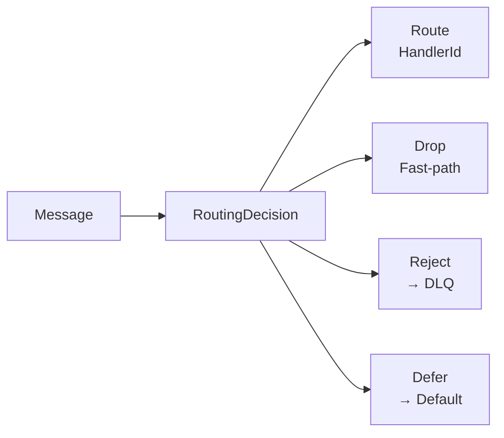

# Routing

KafPy routes messages to Python handlers through a configurable routing chain with precedence-based evaluation.

## Routing Chain Architecture

```mermaid
graph TD
    MSG[Incoming Message] --> CTX[RoutingContext<br/>topic, key, headers, payload]

    CTX --> CHAIN[RoutingChain<br/>Ordered Router List]

    subgraph Routers
        TP[TopicPatternRouter<br/>Regex on topic name]
        HR[HeaderRouter<br/>HTTP-header-like headers]
        KR[KeyRouter<br/>Message key routing]
        PY[PythonRouter<br/>Dynamic Python callback]
    end

    CHAIN --> TP
    TP -->|No match| HR
    HR -->|No match| KR
    KR -->|No match| PY
    PY -->|No match| DEF[Default Handler<br/>(optional)]

    TP -->|Match| DEC[RoutingDecision::Route]
    HR -->|Match| DEC
    KR -->|Match| DEC
    PY -->|Match| DEC
    DEF -->|Match| DEC

    DEC --> EXEC[Execute Handler<br/>at HandlerId]
```

## Routing Precedence

The routing chain evaluates in order:

1. **TopicPatternRouter** — Regex match against topic name
2. **HeaderRouter** — HTTP-header-like headers on message
3. **KeyRouter** — Message key (bytes) lookup
4. **PythonRouter** — Dynamic routing via Python callback
5. **Default Handler** — Falls back if no router matches

### Configuration Example

```python
# Routing configuration
routing_config = kafpy.RoutingConfig(
    default_handler="default-handler",
    routers=[
        kafpy.TopicPatternRouter(
            pattern=r"^orders\.",
            handler="order-handler",
        ),
        kafpy.HeaderRouter(
            header_name="x-event-type",
            mapping={
                "order.created": "order-created-handler",
                "order.updated": "order-updated-handler",
            },
        ),
    ],
)
```

## RoutingDecision



| Decision | Description | Use Case |
|----------|-------------|----------|
| `Route(HandlerId)` | Route to specific handler | Normal routing |
| `Drop` | Drop message, advance offset | Traffic shaping, sampling |
| `Reject` | Route directly to DLQ | Validation failures |
| `Defer` | Continue chain to next router | Partial routing |

## RoutingContext

```rust
// routing/context.rs
pub struct RoutingContext<'a> {
    pub topic: &'a str,
    pub partition: i32,
    pub offset: i64,
    pub key: Option<&'a [u8]>,
    pub payload: Option<&'a [u8]>,
    pub headers: &'a [(String, Option<Vec<u8>>)],  // value is Option<bytes>
    pub handler_id: Option<HandlerId>,
}

pub struct HandlerId(String);

impl HandlerId {
    pub fn new(id: String) -> Self;
    pub fn as_str(&self) -> &str;
}
```

## HandlerId Type Safety

`HandlerId` is a newtype wrapper around `String` to prevent accidental interchange with topic names:

```rust
// Bad: Using String directly
fn route_to_handler(topic: String) { }

// Good: Using HandlerId newtype
fn route_to_handler(handler_id: HandlerId) { }

// Compile-time safety: HandlerId != String
let topic: String = "my-topic".to_string();
let handler_id: HandlerId = HandlerId::new("my-handler".to_string());

// This won't compile:
// route_to_handler(topic);  // Error: expected HandlerId, found String
```