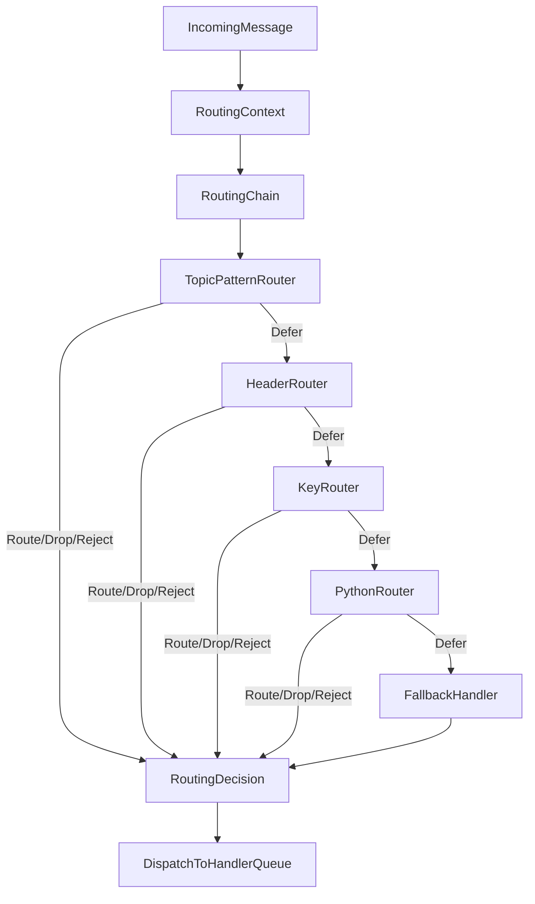
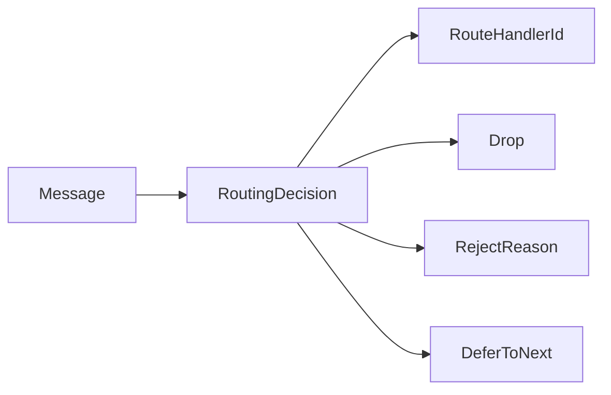

# Routing

KafPy routes messages through a precedence-based Rust routing chain before dispatching to handler queues.

## Routing Chain Architecture


```mermaid
graph TD
    messageIn[IncomingMessage] --> routingContext[RoutingContext]
    routingContext --> chain[RoutingChain]
    chain --> topicRouter[TopicPatternRouter]
    topicRouter -->|"Defer"| headerRouter[HeaderRouter]
    headerRouter -->|"Defer"| keyRouter[KeyRouter]
    keyRouter -->|"Defer"| pythonRouter[PythonRouter]
    pythonRouter -->|"Defer"| fallbackHandler[FallbackHandler]
    topicRouter -->|"Route/Drop/Reject"| decisionOut[RoutingDecision]
    headerRouter -->|"Route/Drop/Reject"| decisionOut
    keyRouter -->|"Route/Drop/Reject"| decisionOut
    pythonRouter -->|"Route/Drop/Reject"| decisionOut
    fallbackHandler --> decisionOut
    decisionOut --> dispatchQueue[DispatchToHandlerQueue]
```

## Routing Precedence

The chain evaluates in order:

1. **TopicPatternRouter** — Regex match against topic name
2. **HeaderRouter** — HTTP-header-like headers on message
3. **KeyRouter** — Message key (bytes) lookup
4. **PythonRouter** — Dynamic routing via Python callback
5. **Fallback handler** — selected when all routers defer

The current Python public API does not yet expose first-class routing rule builders; routing rules are assembled in the Rust runtime path.

## PythonRouter Runtime Behavior

- Router callback execution is bounded by a semaphore (`KAFPY_ROUTER_CONCURRENCY`, default `4`) to reduce GIL thrash during bursts.
- Router path emits Python-call metrics into the shared runtime sink:
  - `kafpy.python.call_total`
  - `kafpy.python.call_duration_seconds`
  - `kafpy.python.queue_wait_seconds`
  - `kafpy.python.batch_size`
  - `kafpy.python.backpressure_total`

### Callback Contracts

- **Default contract**: `def route(msg: dict) -> str`
- **Batch contract (opt-in)**: `def route(batch: list[dict]) -> list[str]`  
  Enabled with `KAFPY_ROUTER_BATCH_MODE=true`.

## RoutingDecision


```mermaid
graph LR
    messageIn[Message] --> decision[RoutingDecision]
    decision --> route[RouteHandlerId]
    decision --> drop[Drop]
    decision --> reject[RejectReason]
    decision --> defer[DeferToNext]
```

| Decision | Description | Use Case |
|----------|-------------|----------|
| `Route(HandlerId)` | Route to specific handler | Normal routing |
| `Drop` | Drop message, advance offset | Traffic shaping, sampling |
| `Reject` | Rejected from routing path; passed to dispatcher error path | Validation failures / callback errors |
| `Defer` | Continue chain to next router | Partial routing |

## RoutingContext

```rust
// routing/context.rs
pub struct RoutingContext<'a> {
    pub topic: &'a str,
    pub partition: i32,
    pub offset: i64,
    pub key: Option<&'a [u8]>,
    pub payload: Option<&'a [u8]>,
    pub headers: &'a [(String, Option<Vec<u8>>)],
}

pub struct HandlerId(String);

impl HandlerId {
    pub fn new(id: String) -> Self;
    pub fn as_str(&self) -> &str;
}
```

## HandlerId Type Safety

`HandlerId` is a newtype wrapper around `String` to prevent accidental interchange with topic names:

```rust
// Bad: Using String directly
fn route_to_handler(topic: String) { }

// Good: Using HandlerId newtype
fn route_to_handler(handler_id: HandlerId) { }

// Compile-time safety: HandlerId != String
let topic: String = "my-topic".to_string();
let handler_id: HandlerId = HandlerId::new("my-handler".to_string());

// This won't compile:
// route_to_handler(topic);  // Error: expected HandlerId, found String
```