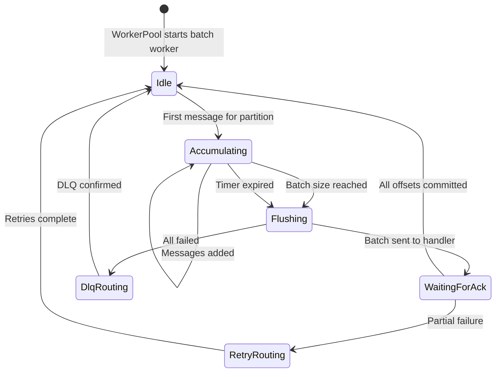
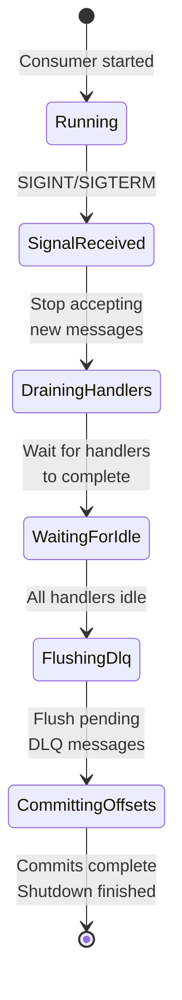

# State Machines

KafPy uses explicit state enums instead of boolean flags for better type safety and exhaustive matching.

## WorkerState

The `WorkerState` enum tracks the state of a worker task processing a message.

```mermaid
stateDiagram-v2
    [*] --> Idle: WorkerPool spawns worker
    Idle --> Processing: Message received from queue
    Processing --> Retrying: ExecutionResult::Retry
    Processing --> WaitingForAck: Message executed, awaiting ack
    Retrying --> Processing: Backoff elapsed, retry execution
    Retrying --> WaitingForAck: Retry succeeded
    Retrying --> DlqRouting: Max retries exceeded
    WaitingForAck --> Idle: Offset committed
    DlqRouting --> Idle: DLQ produce confirmed
    Processing --> DlqRouting: ExecutionResult::Dlq
```

### States

| State | Meaning |
|-------|---------|
| `Idle` | Worker ready to process next message |
| `Processing` | Currently executing Python handler |
| `Retrying` | Scheduled for retry after backoff |
| `WaitingForAck` | Handler succeeded, waiting for offset commit |
| `DlqRouting` | Routing to DLQ after permanent failure |

### Transitions

```rust
// worker_pool/state.rs
pub enum WorkerState {
    Idle,
    Processing { message: OwnedMessage },
    Retrying {
        message: OwnedMessage,
        attempt: u32,
        next_retry_at: Instant,
    },
    WaitingForAck {
        offset: i64,
        partition: i32,
        topic: String,
    },
    DlqRouting {
        message: OwnedMessage,
        reason: FailureReason,
    },
}
```

---

## BatchState

The `BatchState` enum tracks batch accumulation and flush for batch handler modes.



### States

| State | Meaning |
|-------|---------|
| `Idle` | No batch in progress |
| `Accumulating` | Collecting messages for batch |
| `Flushing` | Batch sent to Python handler |
| `WaitingForAck` | Awaiting offset commits for batch |
| `RetryRouting` | Individual retry/DLQ for failed messages |
| `DlqRouting` | All batch messages routing to DLQ |

---

## ShutdownPhase

The `ShutdownPhase` enum tracks the 4-phase graceful shutdown lifecycle.



### Phases

| Phase | Description |
|-------|-------------|
| `Running` | Normal operation |
| `SignalReceived` | Shutdown signal received, stop accepting new messages |
| `DrainingHandlers` | Waiting for in-flight handler executions |
| `WaitingForIdle` | All handlers complete, flush DLQ |
| `FlushingDlq` | Producing remaining DLQ messages |
| `CommittingOffsets` | Final offset commit before exit |

---

## RetryCoordinator State

The `RetryCoordinator` tracks retry state per message using a 3-tuple.

```mermaid
stateDiagram-v2
    [*] --> NotScheduled: Message received
    NotScheduled --> Scheduled: RetryPolicy::should_retry
    Scheduled --> NotScheduled: Retry succeeded (ack)
    Scheduled --> DlqRouting: should_dlq = true
    Scheduled --> Exhausted: attempt >= max_attempts
    DlqRouting --> [*]
    Exhausted --> [*]
```

### 3-Tuple Decision

```rust
pub struct RetryDecision {
    pub should_retry: bool,
    pub should_dlq: bool,
    pub delay: Option<Duration>,
}
```

| should_retry | should_dlq | delay | Action |
|-------------|------------|-------|--------|
| true | false | Some(d) | Retry after delay |
| true | true | Some(d) | Retry then DLQ if fails |
| false | true | None | Immediate DLQ |
| false | false | None | Ack without commit (silent drop) |

---

## HandlerMode State

The `HandlerMode` enum (from v1.6) determines how handlers execute.

```mermaid
stateDiagram-v2
    [*] --> ModeSelected: Handler registered

    ModeSelected --> SingleSync: HandlerMode::SingleSync
    ModeSelected --> SingleAsync: HandlerMode::SingleAsync
    ModeSelected --> BatchSync: HandlerMode::BatchSync
    ModeSelected --> BatchAsync: HandlerMode::BatchAsync

    SingleSync --> [*]: Handler completes
    SingleAsync --> [*]: Future completes
    BatchSync --> [*]: Batch completes
    BatchAsync --> [*]: Batch future completes
```

### Modes

| Mode | Description |
|------|-------------|
| `SingleSync` | One message at a time, synchronous handler |
| `SingleAsync` | One message at a time, async handler via `into_future()` |
| `BatchSync` | Fixed-window batch, synchronous batch handler |
| `BatchAsync` | Fixed-window batch, async batch handler |