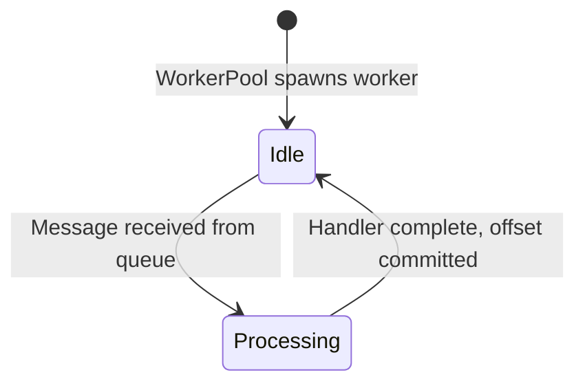
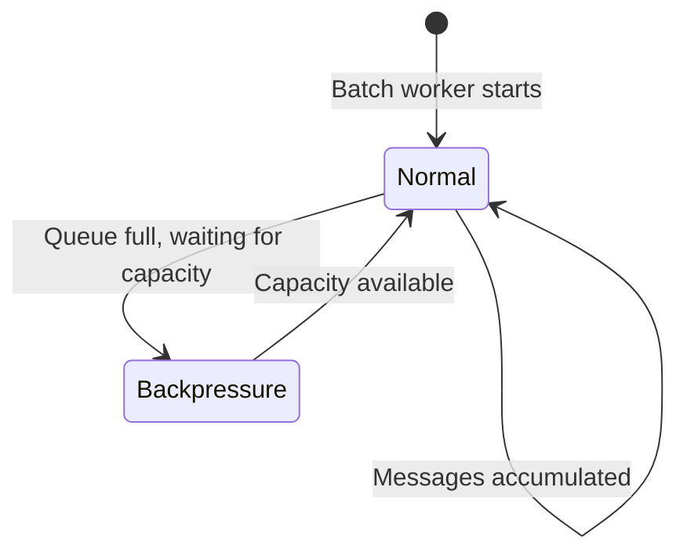
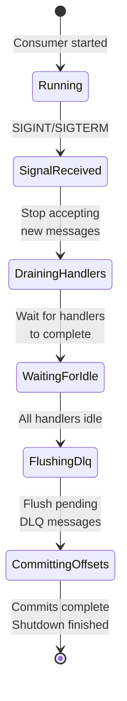
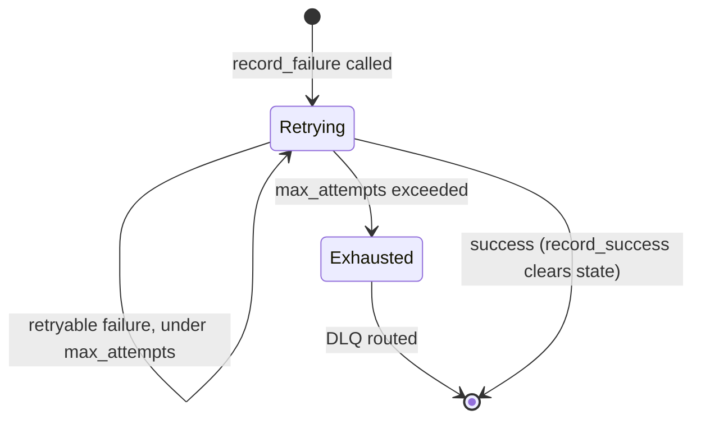

# State Machines

KafPy uses explicit state enums instead of boolean flags for better type safety and exhaustive matching.

## WorkerState

The `WorkerState` enum tracks the state of a worker task processing a message.



### States

| State | Meaning |
|-------|---------|
| `Idle` | Worker ready to process next message |
| `Processing` | Currently executing Python handler with message in scope |

### Transitions

```rust
// worker_pool/state.rs
pub enum WorkerState {
    Idle,
    Processing(OwnedMessage),
}
```

---

## BatchState

The `BatchState` enum tracks batch accumulation and flush for batch handler modes.



### States

| State | Meaning |
|-------|---------|
| `Normal` | Accumulating messages, flushing on batch full/deadline |
| `Backpressure` | Flushed accumulator, blocking on capacity |

---

## ShutdownPhase

The `ShutdownPhase` enum tracks the 4-phase graceful shutdown lifecycle.



### Phases

| Phase | Description |
|-------|-------------|
| `Running` | Normal operation |
| `SignalReceived` | Shutdown signal received, stop accepting new messages |
| `DrainingHandlers` | Waiting for in-flight handler executions |
| `WaitingForIdle` | All handlers complete, flush DLQ |
| `FlushingDlq` | Producing remaining DLQ messages |
| `CommittingOffsets` | Final offset commit before exit |

---

## RetryCoordinator State

The `RetryCoordinator` tracks retry state per message using `RetryState` enum.



### RetryState Enum

```rust
// retry/retry_coordinator.rs
pub enum RetryState {
    Retrying {
        topic: String,
        partition: i32,
        offset: i64,
        attempt: usize,
        last_failure: FailureReason,
        first_failure: DateTime<Utc>,
    },
    Exhausted {
        topic: String,
        partition: i32,
        offset: i64,
        last_failure: FailureReason,
        first_failure: DateTime<Utc>,
    },
}
```

### record_failure Return Value

The `record_failure()` method returns a 3-tuple `(should_retry, should_dlq, delay)`:

| should_retry | should_dlq | delay | Action |
|-------------|------------|-------|--------|
| true | false | Some(d) | Retry after delay |
| false | true | None | Immediate DLQ |

The 3-tuple is the **return value** of `record_failure()`, not a stored state. The actual state is stored in the `RetryState` enum.

---

## HandlerMode State

The `HandlerMode` enum (from v1.6) determines how handlers execute.

```mermaid
stateDiagram-v2
    [*] --> ModeSelected: Handler registered

    ModeSelected --> SingleSync: HandlerMode::SingleSync
    ModeSelected --> SingleAsync: HandlerMode::SingleAsync
    ModeSelected --> BatchSync: HandlerMode::BatchSync
    ModeSelected --> BatchAsync: HandlerMode::BatchAsync

    SingleSync --> [*]: Handler completes
    SingleAsync --> [*]: Future completes
    BatchSync --> [*]: Batch completes
    BatchAsync --> [*]: Batch future completes
```

### Modes

| Mode | Description |
|------|-------------|
| `SingleSync` | One message at a time, synchronous handler |
| `SingleAsync` | One message at a time, async handler via `into_future()` |
| `BatchSync` | Fixed-window batch, synchronous batch handler |
| `BatchAsync` | Fixed-window batch, async batch handler |