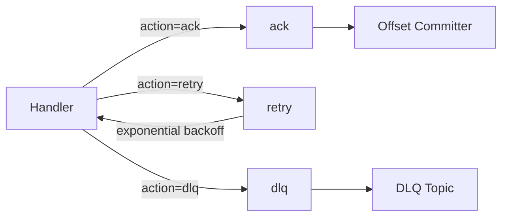
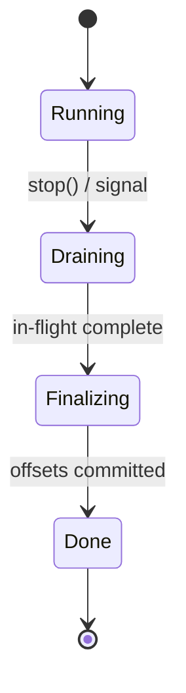
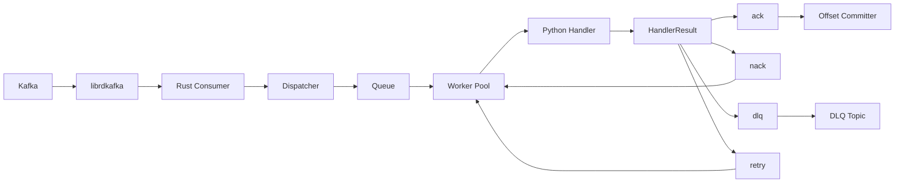
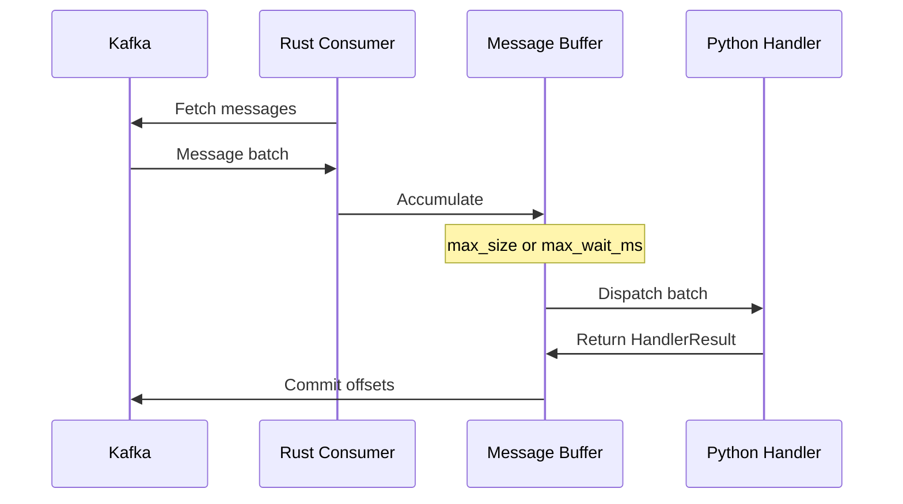

# Guides

Practical guides for common KafPy patterns. Each guide is self-contained with working examples.

## Contents

- [Your First Consumer](#your-first-consumer)
- [Batch Processing](#batch-processing)
- [Backpressure and Flow Control](#backpressure-and-flow-control)
- [Authentication with SASL](#authentication-with-sasl)
- [Retry and Dead-Letter Queues](#retry-and-dead-letter-queues)
- [Custom Middleware](#custom-middleware)
- [Error Handling Patterns](#error-handling-patterns)
- [Graceful Shutdown](#graceful-shutdown)
- [Offset Commit](#offset-commit)
- [Performance Tuning](#performance-tuning)

---

## Your First Consumer

A KafPy consumer ties together a `ConsumerConfig`, a `Consumer`, and handler functions registered with the `KafPy` runtime.

```python
import kafpy

config = kafpy.ConsumerConfig(
    bootstrap_servers="localhost:9092",
    group_id="my-group",
    topics=["orders", "shipments"],
)

consumer = kafpy.Consumer(config)
app = kafpy.KafPy(consumer)


@app.handler(topic="orders")
def handle_order(msg: kafpy.KafkaMessage, ctx: kafpy.HandlerContext) -> kafpy.HandlerResult:
    print(f"Order {msg.key} @ {ctx.topic}:{ctx.partition}:{ctx.offset}")
    return kafpy.HandlerResult(action="ack")


app.start()
```

The `start()` call blocks the current thread. It is not async — do not use `await`.

---

## Batch Processing

For high-throughput workloads, process messages in batches using `@app.batch_handler`. Batch handlers receive a list of messages instead of one at a time.

```python
@app.batch_handler(topic="clicks", max_size=200, max_wait_ms=500)
def handle_clicks_batch(messages: list[kafpy.KafkaMessage], ctx) -> kafpy.HandlerResult:
    records = [msg.payload for msg in messages]
    db.bulk_insert(records)
    return kafpy.HandlerResult(action="ack")
```

The batch is delivered when either `max_size` messages accumulate or `max_wait_ms` elapses, whichever comes first.

### Batch Handler Parameters

| Parameter | Default | Description |
|-----------|---------|-------------|
| `max_size` | 100 | Maximum messages per batch |
| `max_wait_ms` | 1000 | Maximum wait time before dispatch |

### Batch vs Single-Message Handlers

| Pattern | Decorator | Handler Signature |
|---------|-----------|-----------------|
| Single | `@app.handler(topic="...")` | `def handle(msg, ctx) -> HandlerResult` |
| Batch | `@app.batch_handler(topic="...")` | `def handle(messages: list, ctx) -> HandlerResult` |

---

## Backpressure and Flow Control

KafPy automatically applies backpressure to prevent unbounded memory growth when Python handlers cannot keep up with message production.

### How It Works

1. **In-flight limit** — The Rust consumer maintains an in-flight message limit (default 1000 messages per partition)
2. **Pause** — When in-flight messages reach the limit, the Kafka partition is **paused**. No new messages are fetched.
3. **Resume** — When in-flight drops below the limit, the partition is **resumed**. Fetching continues.

This is fully automatic — no configuration or user code required.

### GIL Consideration

Python handlers run in worker threads. Because of the GIL, only one Python thread executes Python code at a time. For CPU-bound workloads, consider increasing `num_workers` to increase thread count — the GIL is released during I/O operations, so concurrent I/O-bound handlers still benefit from parallelism.

```python
config = kafpy.ConsumerConfig(
    bootstrap_servers="localhost:9092",
    group_id="consumer",
    topics=["events"],
    num_workers=8,  # more threads for I/O-bound handlers
)
```

---

## Authentication with SASL

Configure `security_protocol` and SASL credentials in `ConsumerConfig`:

```python
config = kafpy.ConsumerConfig(
    bootstrap_servers="broker1:9092,broker2:9092",
    group_id="secure-consumer",
    topics=["sensitive-data"],
    security_protocol="SASL_SSL",
    sasl_mechanism="SCRAM-SHA-512",
    sasl_username="myuser",
    sasl_password="redacted",
)
```

Supported combinations:

| `security_protocol` | `sasl_mechanism` |
|---------------------|------------------|
| `PLAINTEXT` | None |
| `SSL` | None |
| `SASL_PLAINTEXT` | `PLAIN`, `SCRAM-SHA-256`, `SCRAM-SHA-512` |
| `SASL_SSL` | `PLAIN`, `SCRAM-SHA-256`, `SCRAM-SHA-512` |

---

## Retry and Dead-Letter Queues

KafPy has built-in support for retry with exponential backoff and DLQ routing. Configure it via `ConsumerConfig.retry_policy` and `ConsumerConfig.dlq_topic_prefix`.

```python
config = kafpy.ConsumerConfig(
    bootstrap_servers="localhost:9092",
    group_id="robust-consumer",
    topics=["events"],
    # Retry up to 3 times with 100ms base delay, max 5s, 10% jitter
    retry_policy=kafpy.RetryConfig(
        max_attempts=3,
        base_delay=0.1,        # seconds
        max_delay=5.0,         # seconds
        jitter_factor=0.1,
    ),
    dlq_topic_prefix="dlq.",   # dlq.events, dlq.orders, etc.
)
```

In your handler, return `"retry"` to explicitly request retry (e.g., for a transient failure), or `"dlq"` for poison messages:

```python
@app.handler(topic="events")
def handle_event(msg: kafpy.KafkaMessage, ctx: kafpy.HandlerContext) -> kafpy.HandlerResult:
    try:
        process(msg.payload)
        return kafpy.HandlerResult(action="ack")
    except TransientError as e:
        return kafpy.HandlerResult(action="retry")  # respects retry_policy
    except PoisonMessage as e:
        return kafpy.HandlerResult(action="dlq")   # bypasses retry, goes to dlq.events
```

### Retry and DLQ Flow



---

## Custom Middleware

Middleware lets you intercept every handler call for logging, metrics, or custom logic. Subclass `kafpy.BaseMiddleware` and override the hooks you need.

### Logging Middleware

```python
import logging
import kafpy

logger = logging.getLogger("myapp")


class RequestLogging(kafpy.BaseMiddleware):
    def before(self, ctx: dict) -> None:
        logger.info(f"Handling message on {ctx['topic']} partition {ctx['partition']}")

    def after(self, ctx: dict, result: str, elapsed_ms: float) -> None:
        logger.info(f"Completed {ctx['topic']} in {elapsed_ms:.2f}ms → {result}")

    def on_error(self, ctx: dict, result: str) -> None:
        logger.error(f"Failed {ctx['topic']} partition {ctx['partition']} → {result}")
```

### Metrics Middleware

```python
import time
import kafpy

class PrometheusMetrics(kafpy.BaseMiddleware):
    def __init__(self):
        self.latencies: dict[str, list[float]] = {}

    def before(self, ctx: dict) -> None:
        ctx["_start_time"] = time.monotonic()

    def after(self, ctx: dict, result: str, elapsed_ms: float) -> None:
        handler = ctx.get("handler_name", "unknown")
        self.latencies.setdefault(handler, []).append(elapsed_ms)
        # expose to Prometheus: handler_latency_ms{handler="...",result="..."}
```

Register middleware per-handler:

```python
@app.handler(topic="events", middleware=[RequestLogging(), PrometheusMetrics()])
def handle_event(msg: kafpy.KafkaMessage, ctx: kafpy.HandlerContext) -> kafpy.HandlerResult:
    return kafpy.HandlerResult(action="ack")
```

Or use the built-in `kafpy.Logging()` and `kafpy.Metrics()` middleware directly.

---

## Error Handling Patterns

### Handler Timeouts

Set a `handler_timeout_ms` on the config to cancel handlers that exceed a threshold:

```python
config = kafpy.ConsumerConfig(
    bootstrap_servers="localhost:9092",
    group_id="consumer",
    topics=["events"],
    handler_timeout_ms=5000,  # 5 seconds
)
```

Timed-out handlers are treated as failures and routed according to your retry policy.

### Per-Handler Timeout

Override the global timeout for a specific handler:

```python
@app.handler(topic="slow-events", timeout_ms=30000)  # 30s for this handler
def handle_slow(msg: kafpy.KafkaMessage, ctx: kafpy.HandlerContext) -> kafpy.HandlerResult:
    result = long_running_task(msg.payload)
    return kafpy.HandlerResult(action="ack")
```

### Structured Error Propagation

Raise `HandlerError` for handler-level errors. Raise `ConsumerError` for consumer-level errors (e.g., deserialization failures):

```python
from kafpy.exceptions import HandlerError, ConsumerError

@app.handler(topic="orders")
def handle_order(msg: kafpy.KafkaMessage, ctx: kafpy.HandlerContext) -> kafpy.HandlerResult:
    if msg.payload is None:
        raise HandlerError(
            message="missing payload",
            error_code=None,
            partition=ctx.partition,
            topic=ctx.topic,
        )
    return kafpy.HandlerResult(action="ack")
```

---

## Graceful Shutdown

Use the context manager protocol to ensure the consumer drains in-flight messages before exiting:

```python
import kafpy

config = kafpy.ConsumerConfig(...)
consumer = kafpy.Consumer(config)
app = kafpy.KafPy(consumer)

with consumer:
    app.start()  # blocks
# consumer.stop() is called automatically on exit
```

The `Consumer.__exit__` calls `stop()`, which initiates a 4-phase drain:



1. **Running** → stops accepting new messages
2. **Draining** → waits for in-flight handler calls to finish (up to `drain_timeout_secs`)
3. **Finalizing** → commits offsets
4. **Done** → consumer closed

Set `drain_timeout_secs` in your config to control how long the drain phase waits:

```python
config = kafpy.ConsumerConfig(
    bootstrap_servers="localhost:9092",
    group_id="consumer",
    topics=["events"],
    drain_timeout_secs=60,  # wait up to 60s for in-flight messages
)
```

---

## Offset Commit

KafPy commits offsets using a hybrid signal-driven architecture for low-latency persistence.

### How It Works

1. **Message ack** — When your handler returns `action="ack"`, the offset is recorded immediately
2. **Signal** — The offset tracker signals the committer for that specific topic-partition
3. **Throttle check** — Commits execute if the interval has elapsed or the batch threshold is reached
4. **Kafka persist** — `store_offset` + `commit` is called for the highest contiguous offset

### Throttle Parameters

The committer applies two throttles:

| Parameter | Default | Effect |
|-----------|---------|--------|
| `commit_interval_ms` | 100 | Spacing between commit cycles (minimum 100ms) |
| `commit_max_messages` | 100 | Forces commit when accumulated messages reach this count |

This means commits happen at least every 100ms, or sooner if 100 messages accumulate.

### Signal-Driven Architecture

The key benefit of signal-driven commits is **per-partition responsiveness**. When a message is acked, only its topic-partition is immediately evaluated for commit — no scanning of all partitions. This provides:

- Low latency commit for low-volume partitions (commit within 100ms of ack)
- High throughput for high-volume partitions (batch threshold triggers commit)
- No busy-waiting — committer sleeps between interval ticks

### Graceful Shutdown Commit

During [Graceful Shutdown](#graceful-shutdown), all pending offsets are committed before the consumer exits (Phase 3: Finalizing).

---

## Performance Tuning

### Concurrency

By default, KafPy uses 4 worker threads. Adjust with `num_workers`:

```python
config = kafpy.ConsumerConfig(
    bootstrap_servers="localhost:9092",
    group_id="high-throughput",
    topics=["events"],
    num_workers=16,  # more threads for I/O-bound handlers
)
```

Or set per-handler concurrency:

```python
@app.handler(topic="events", concurrency=8)  # max 8 concurrent executions
def handle_event(msg: kafpy.KafkaMessage, ctx: kafpy.HandlerContext) -> kafpy.HandlerResult:
    ...
```

### Fetch Tuning

Reduce round-trips to the broker by increasing fetch sizes:

```python
config = kafpy.ConsumerConfig(
    bootstrap_servers="localhost:9092",
    group_id="consumer",
    topics=["events"],
    fetch_min_bytes=4096,            # wait until at least 4KB is available
    max_partition_fetch_bytes=524288,  # 512KB per partition (default)
)
```

### Batch Processing

For maximum throughput on bulk workloads, always prefer batch handlers:

```python
@app.batch_handler(
    topic="bulk-events",
    max_size=500,
    max_wait_ms=100,  # short wait for throughput; tune against your workload
)
def handle_bulk(messages: list[kafpy.KafkaMessage], ctx) -> kafpy.HandlerResult:
    db.bulk_write([msg.payload for msg in messages])
    return kafpy.HandlerResult(action="ack")
```

### Observability

Enable OTLP tracing to identify latency bottlenecks:

```python
config = kafpy.ConsumerConfig(
    bootstrap_servers="localhost:9092",
    group_id="consumer",
    topics=["events"],
    observability_config=kafpy.ObservabilityConfig(
        otlp_endpoint="http://localhost:4317",
        service_name="my-consumer",
        sampling_ratio=0.1,  # sample 10% of messages in production
        log_format="json",
    ),
)
```

### Handler Timeout

Avoid setting `handler_timeout_ms` too aggressively. The timeout should be at least 2x your p99 handler latency to avoid false positives.

---

## Architecture Diagrams

### Message Flow



### Batch Accumulation



---

## See Also

- [API Reference](api.md) — Full API documentation
- [Best Practices](best-practices.md) — Production recommendations
- [Tutorial](tutorial.md) — Step-by-step introduction
